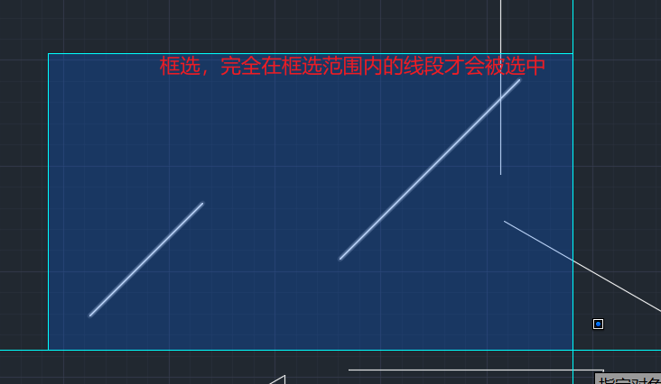
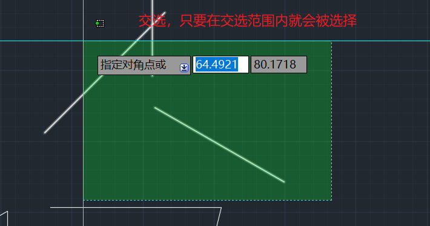

# 基础操作

CAD是通过命令进行交互的，我们可以在选项卡中选择操作，也可以通过命令来进行操作。开启动态输入后，直接输入命令点击空格即可使用，亦可在命令行中输入命令执行

## 框选与交选

AutoCAD中，点击鼠标从左往右选择是框选，只有线段完全被框选才会选中

从右往左选择是交选，只要线段在选择范围内就会被选中

## CAD常用快捷键命令汇总

| 命令  |   功能   | 命令  |   功能   |
| :-: | :----: | :-: | :----: |
|  L  |   直线   |  A  |   圆弧   |
|  C  |   圆    |  T  |  多行文字  |
| XL  |   射线   |  B  |  块定义   |
|  E  |   删除   |  I  |  块插入   |
|  H  |   填充   |  W  | 定义块文件  |
| TR  |   修剪   | CO  |   复制   |
| EX  |   延伸   | MI  |   镜像   |
| PO  |   点    |  O  |   偏移   |
|  S  |   拉伸   |  F  |  倒圆角   |
|  U  |   返回   |  D  |  标注样式  |
| DDI |  直径标注  | DLI |  线性标注  |
| DAN |  角度标注  | DRA |  半径标注  |
| OP  | 系统选项设置 | OS  | 对像捕捉设置 |
| SE  |  草图设置  | sc  |   缩放   |

