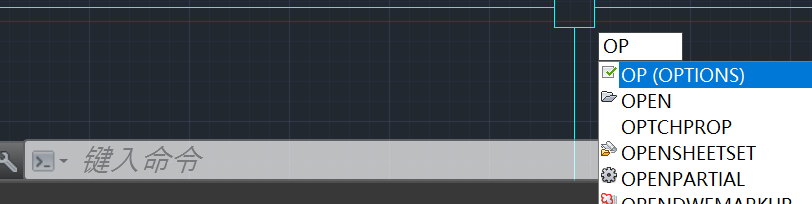
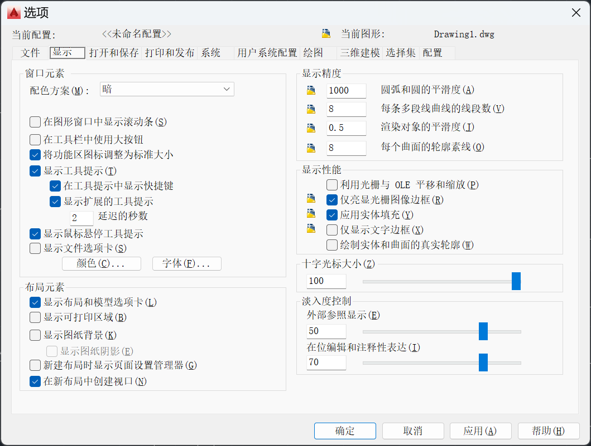
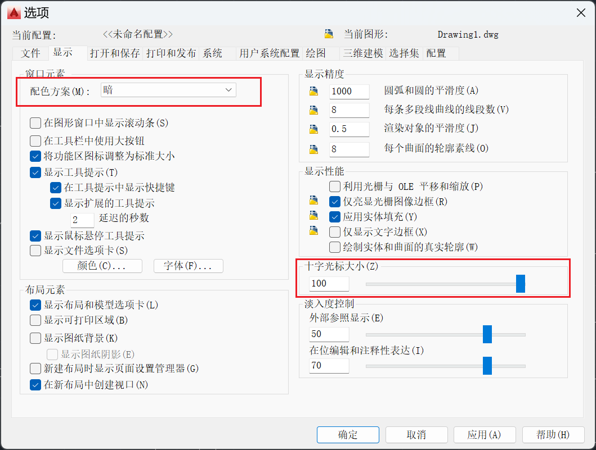
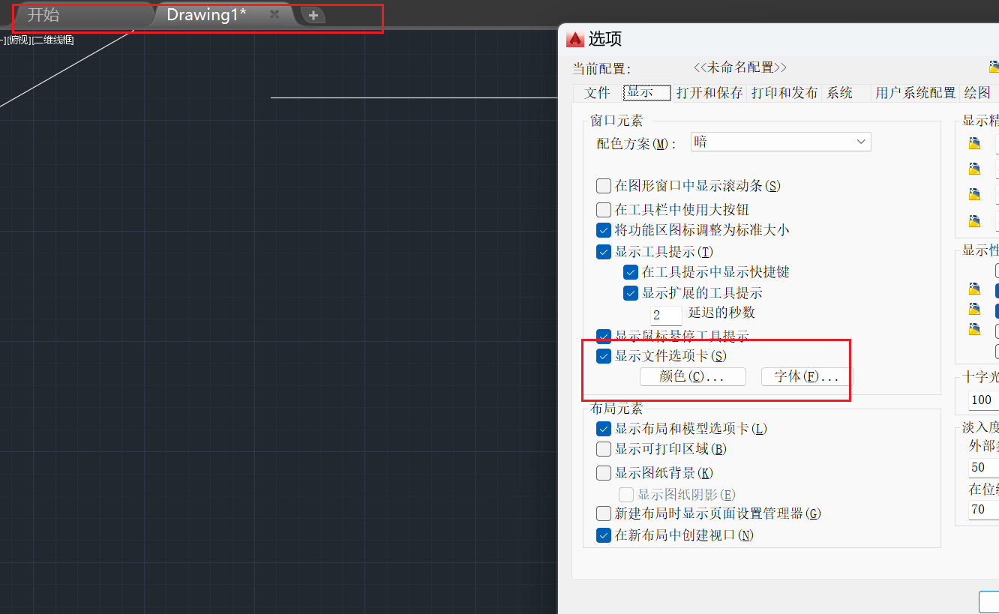
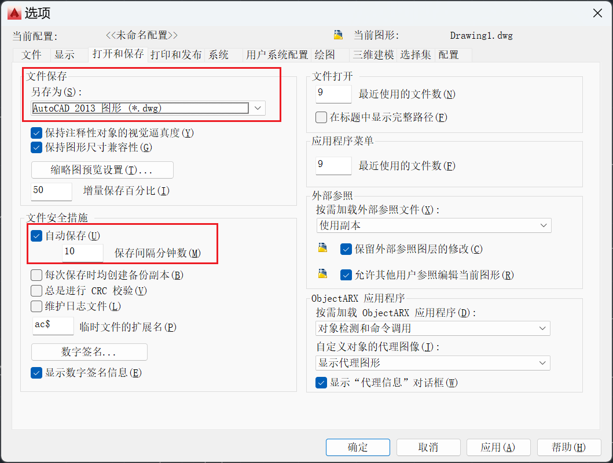
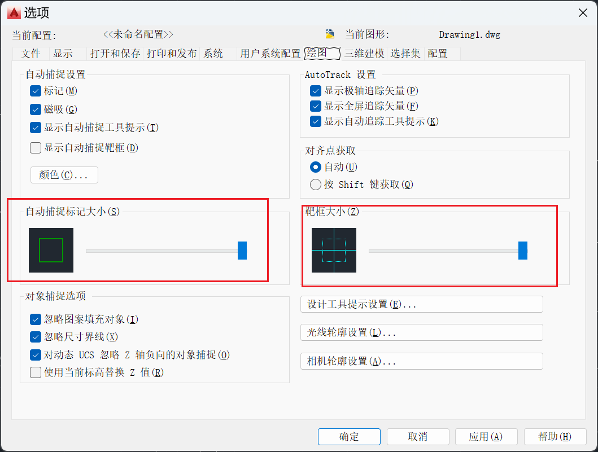

# 选项设置

开启动态输入后，能够直接输入“OP”，命令将会出现在指针处，或在命令行输入“OP”

输入“OP”后点击空格代表提交命令，能够打开CAD的选项页，如下所示：

## 显示

在窗口元素-配色方案中可修改配色方案为明或暗

调整十字光标大小为100，可让十字光标铺满屏幕

勾选 “ 显示文件选项卡 ” 能够显示出当前窗口打开的文件，并在不同文件间进行切换

## 打开和保存

在打开与保存选项卡中，能够对文件默认保存版本进行设置，并对文件自动保存的间隔时间进行设置

## 绘图

建议将绘图选项卡中的自动捕捉标记大小与靶框大小调整至最大

## 选择集

在选择集选项卡中，将拾取框大小与夹点大小调整至最大

配置完成后点击确定即可