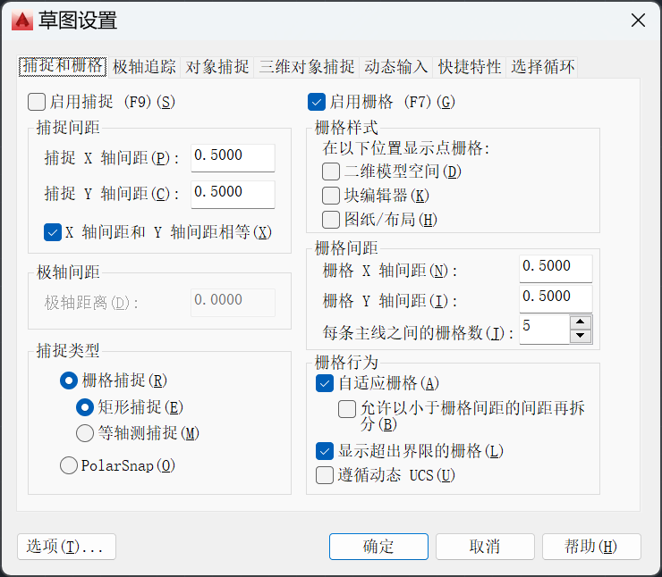
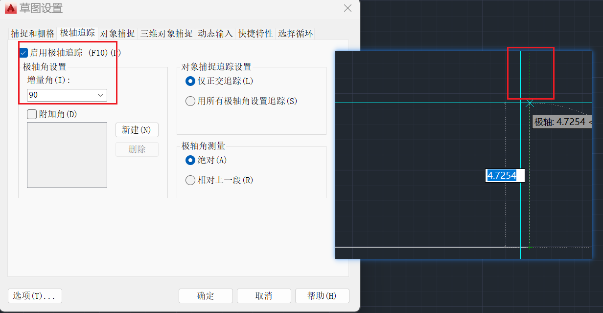
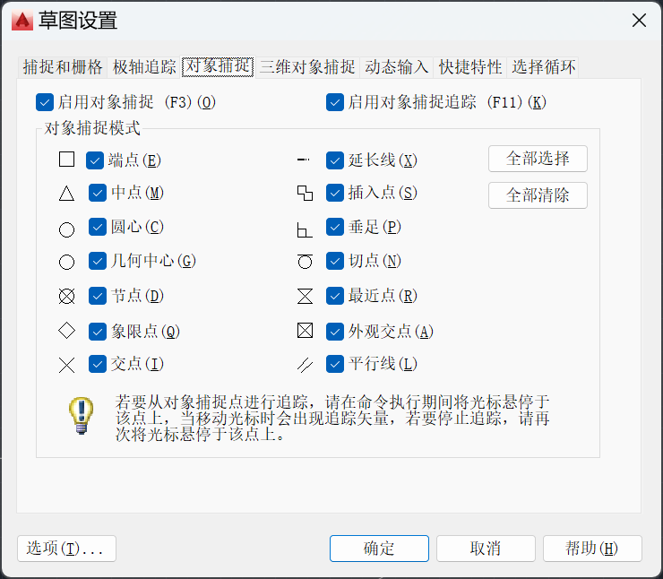
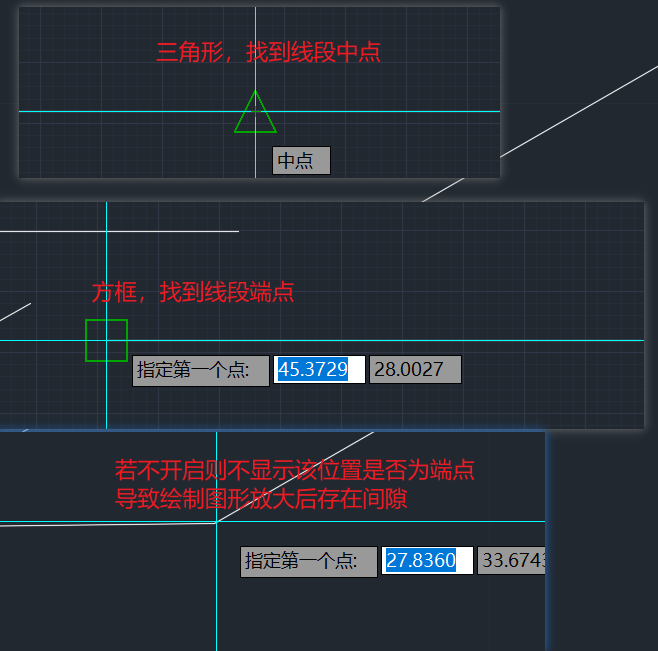
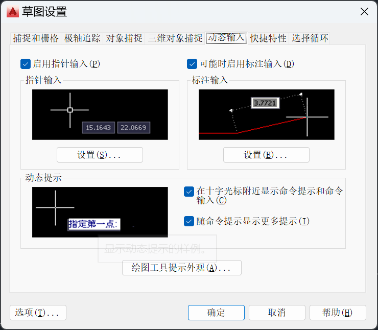
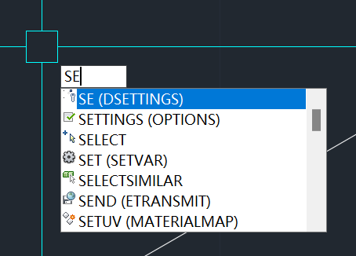

# 草图设置

使用“SE”命令进入草图设置

## 捕捉和栅格

在 “ 捕捉和栅格 ” 选项栏中，建议将 “ 启用捕捉 ” 选项关闭。若开启，在绘图时会自动寻找栅格。可通过F9快捷键快速的关闭或启用 “ 启用捕捉 ” 选项

## 极轴追踪

在“极轴追踪”选项栏中，启用该功能，能够在符合增量角时延伸出一条绿色线条

如图所示，启用极轴追踪后，增量角为90°，当线条夹角达到90°时，线段有了一条绿色的延伸线

如果有其他角度需求，可以在附加角中新增

如果使用快捷键“F8”开启正交，那就只能绘制90°角（开启正交后，极轴追踪会被关闭）

## 对象捕捉

在“对象捕捉”选项栏中，建议启用对象捕捉，并全选对象捕捉模式

启用对象捕捉，在绘制图形的时候能够显示出该位置是线段的端点还是中点等，若不启用，则不会显示。

## 动态输入

在 “ 动态输入 ” 选项栏中，建议勾选 “ 启用指针输入 ” 和 “ 可能时启用标注输入 ” 以及动态提示

启用动态输入，就可以直接输入命令，在十字架下方会出现命令，以及命令提示

