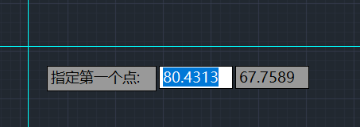
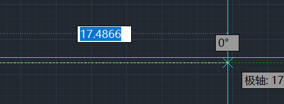
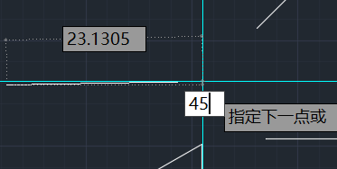
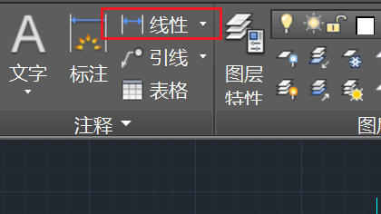
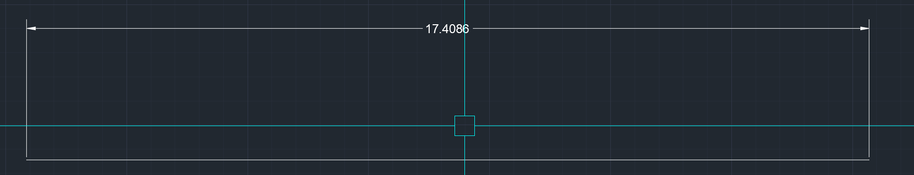
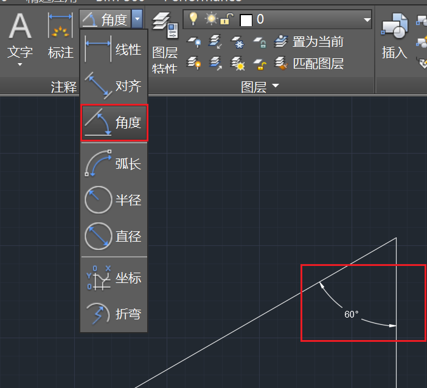

# 绘图

使用“L”命令绘制直线，这是使用最多的命令

使用L命令后可以直接绘图，也可以输入参数进行绘图

首先输入的参数是线段的起点，可以使用鼠标选择起点，也可以输入参数进行选择

接下来输入的参数是线段的长度

如果想要绘制角度，则需要在输入线段长度后使用Tab键切换到角度输入，如果没有输入线段长度直接使用Tab切换到角度输入，则会以光标当前所在位置作为线段长度

## 注释

使用注释中的线性可以测量线段长度并将其标注出来

选择线段的两个端点即可

除了线段长度，还可以测量角度

