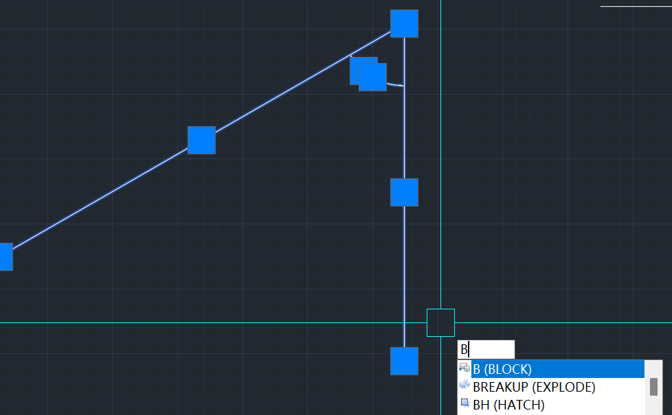
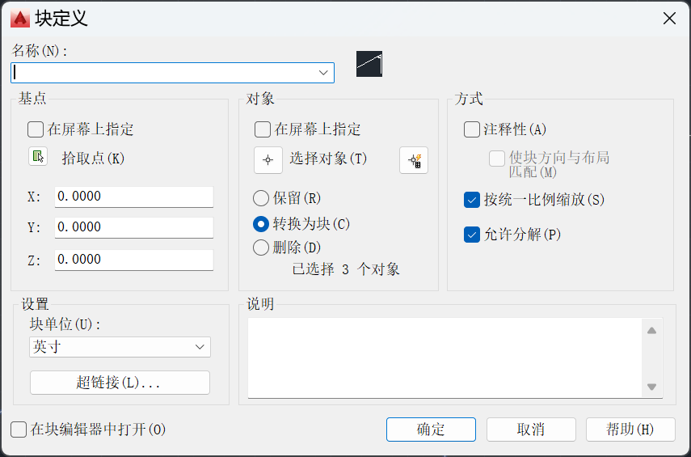
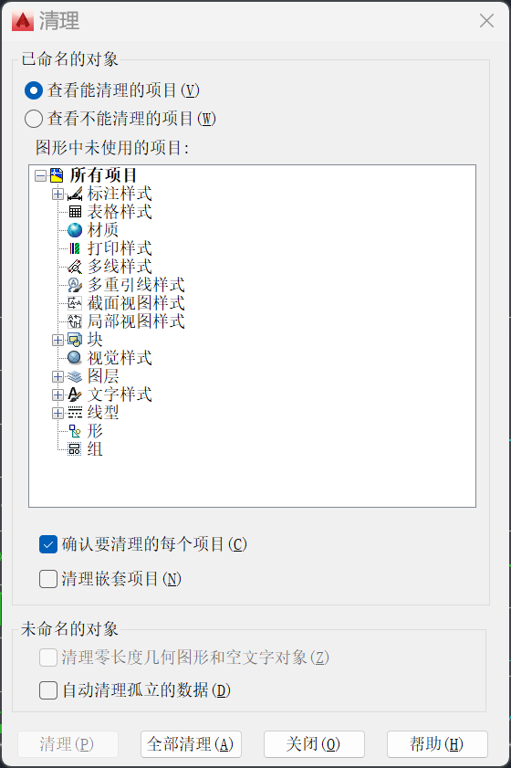
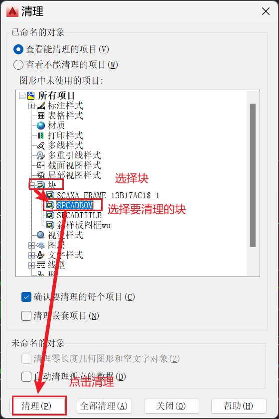

# 块制作

AutoCAD的图形都是由线条与文字组成的，每个都是分开独立存在的，如果要移动、复制一个整体，这么做非常不方便。为此我们能够将其进行组合固化，需要用到“块”

## B命令

选择要组合的部分，使用“B”进入块制作中

在块定义页面输入名称，选择转换为块，并选择拾取点

注意：**拾取点必须选择在图形上**

### 快速组块

选中图形进行剪切，然后使用ctrl+shift+v快捷键即可粘贴为块

## X命令

制作块后，面对需要取消组合的情况，选择该组合使用“X”命令即可将其打散

# 删除块

直接用“X”命令打散块或者选中块用delet删除是无法真正删除块的

首先需要让图纸上没有该块（将其打散或删除）

使用“PURGE”命令进入清理页面

选择“块”=>选择要清理的块，点击清理即可

