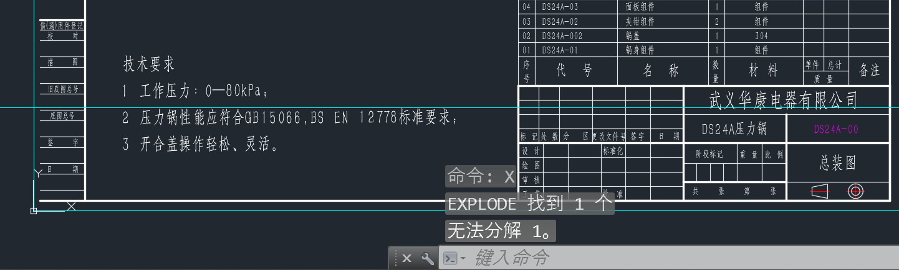
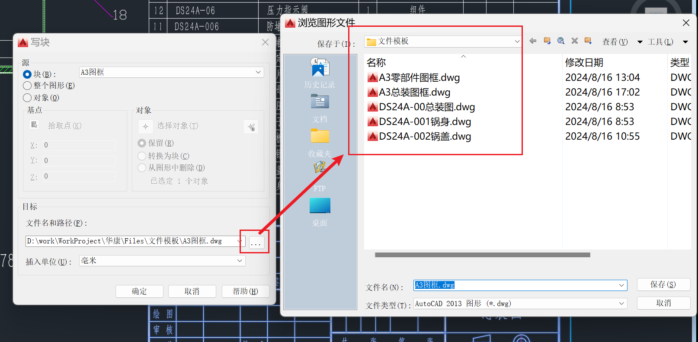
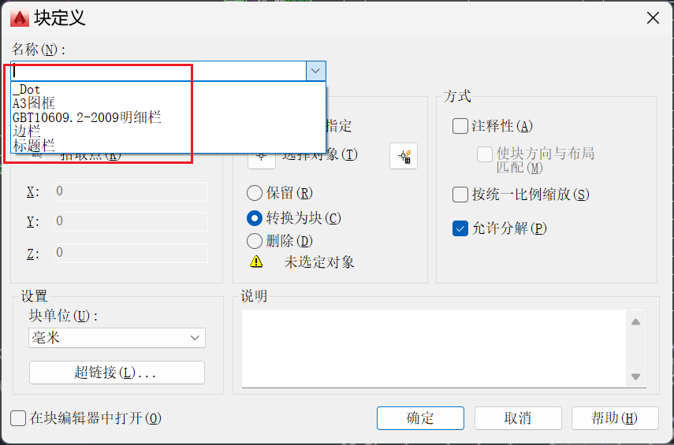
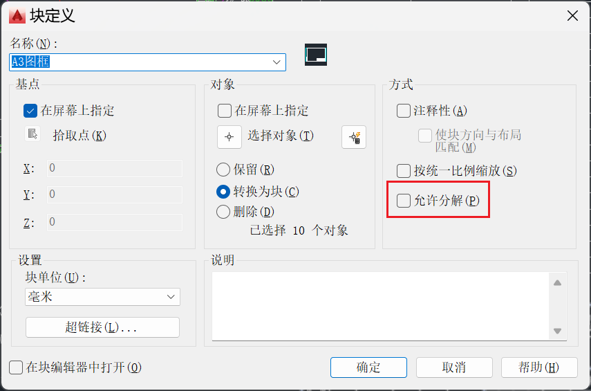
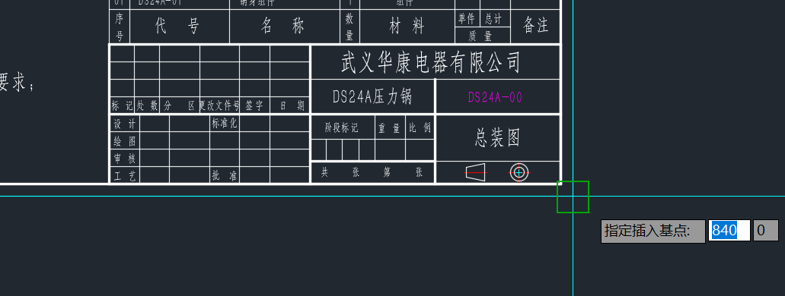
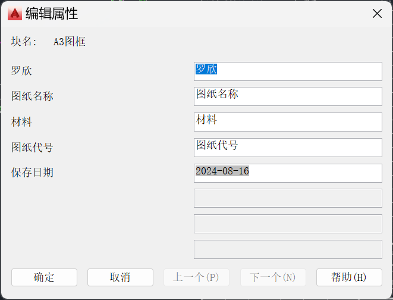

# 块制作

AutoCAD的图形都是由线条与文字组成的，每个都是分开独立存在的，如果要移动、复制一个整体，这么做非常不方便。为此我们能够将其进行组合固化，需要用到“块”

## B命令

选择要组合的部分，使用“B”进入块制作中

在块定义页面输入名称，选择转换为块，并选择拾取点

注意：**拾取点必须选择在图形上**

### 快速组块

选中图形进行剪切，然后使用 `ctrl+shift+v` 快捷键即可粘贴为块

## X命令

制作块后，面对需要取消组合的情况，选择该组合使用 “ X ” 命令即可将其打散

### 无法打散的情况

有时候呢，对块使用 **X命令** 也无法将其打散，会提示无法进行分解

对于这种情况有两种方法可以进行处理

#### 方法一

使用 **WBLOCK命令** 将块另存为一个新的文件

保存之后打开新文件，里面的块就是可以打散的

**缺点**：不能多个块一起选中用 **WBLOCK命令**，会导致不可打散的块仍然不能打散

#### 方法二

**不选择任何块**，直接使用 **BLOCK命令**，在“名称”里找到我们要打散的块

把 **允许分解** 的选项给勾上，这就是不让我们打散块的原因

勾选后点击确定，会提示是否要重新定义块，选择 **重新定义块**

选择基点在右下角

直接保存属性，然后调整图框位置即可

# 删除块

直接用 “ X ” 命令打散块或者选中块用delet删除是无法真正删除块的

首先需要让图纸上没有该块（将其打散或删除）

使用 “ PURGE ” 命令进入清理页面

选择 “ 块 ” => 选择要清理的块，点击清理即可

