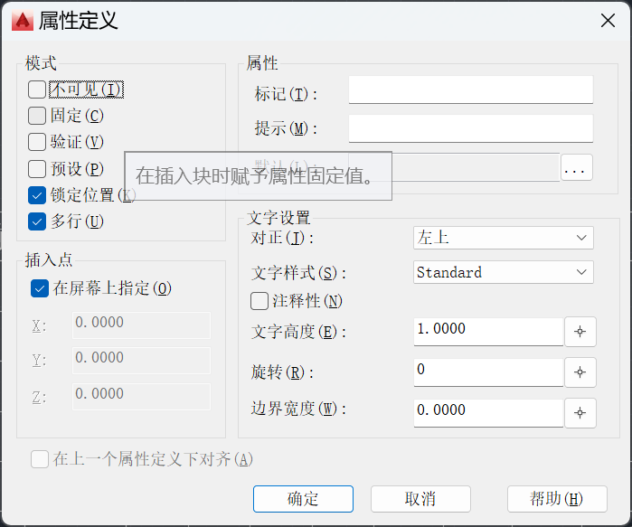
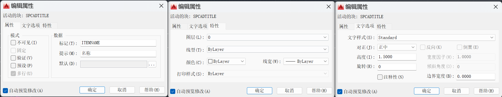

# 属性定义

使用“attdef”命令定义属性（也可在绘图选项栏中选择块=>定义属性）

文字设置栏中的对正方式影响了属性的排布方式，常用对正方式有：正中与布满。

正中需要选择空白栏中的中心店，布满则选择空白栏的左下角与右下角

# 属性修改

对于已经定义好的属性，使用“battman”命令进入块属性管理器进行修改

切换块，能够查询到该块下的所有属性，双击属性可以对其进行修改

若要修改属性大小，还可以使用“scale”命令来放大、缩小属性