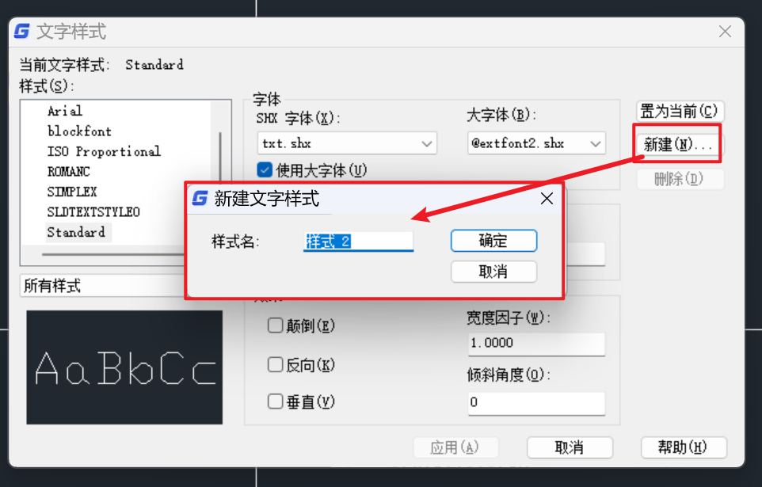
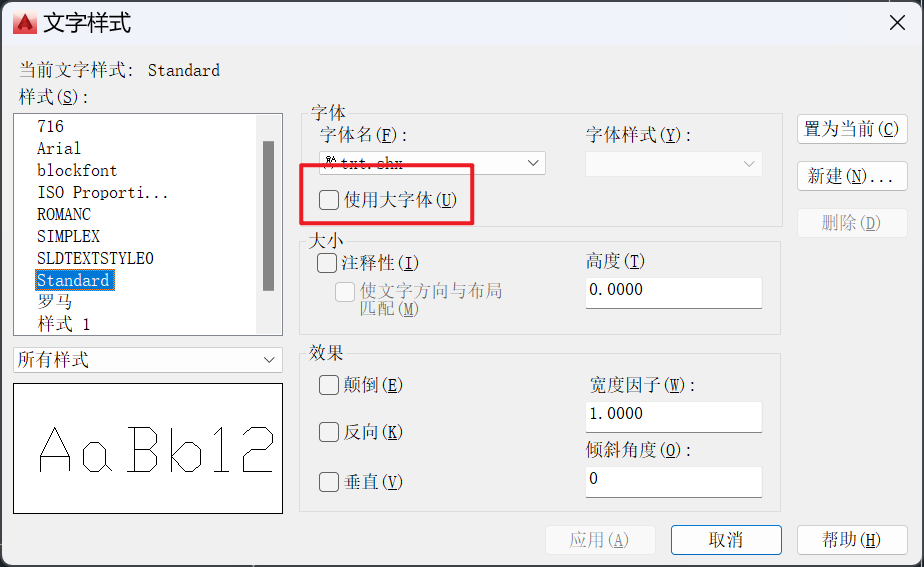
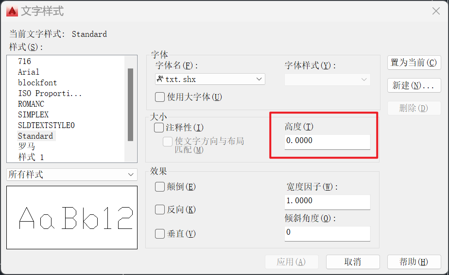

# 文字样式

文字样式其实就是文字模板，为了控制文字的显示效果，需要对文字的高度、角度、字体等属性进行调整，如果分别调整图纸中的每一个文字，效率未免过低。CAD中设置了文字样式功能，可以将字体以及文字的高度、角度等属性调整好，保存在文字样式中。必要时可以设置多个文字样式，这样在需要使用到文字时，只需要简单地为其指定相应的样式，就可以得到对应的文字效果。更重要的是，对某个文字样式中的一些属性进行修改，那么所有使用了该样式的文字均会自动发生改变，为后期图纸的修改提供了极大的便利

使用 `ST` 命令或在格式中选择文字样式可以打开文字样式页

点击新建按钮，可以新建文字样式

在 **字体名** 一栏中可以设置文字样式要使用的字体，没有带后缀名的为操作系统自带的字体，CAD内专用的字体文件，其后缀名是 `.shx`

在 **字体名** 下拉框下面有一个复选框 **使用大体字**（小体字指包含英文、符号等字母的字体，大体字指包含中文、日文、韩文的亚洲字符的字体）

使用默认文字样式时，单行文字中输入中文出现了问号，就是因为默认的文字样式没有设置 **大体字**

文字高度值可以设置文字的高度，一般情况下，文字样式中不设置高度，也就是默认值为0，这样在CAD中使用此文字样式编写单行文字，可以设置成不同高度，如果此处设置了高度，在编写单行文字时将直接使用此高度，不再提示高度

