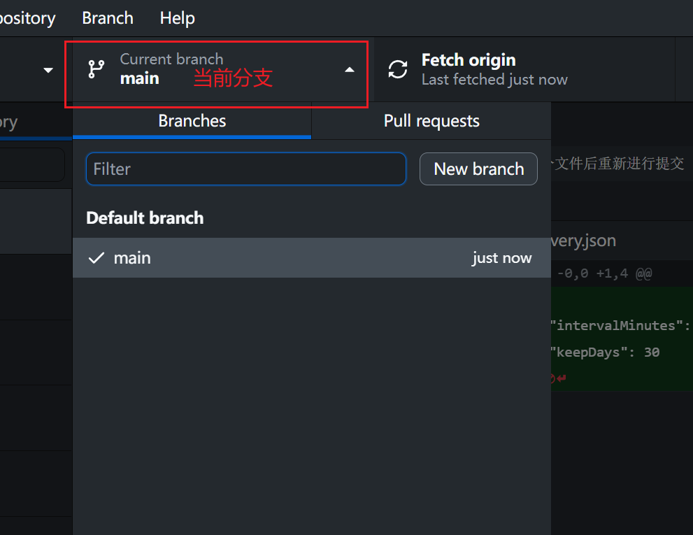

# 介绍

Git的分支管理是Git版本控制系统中一个非常强大且核心的功能，它允许开发人员在不同的分支上并行工作，从而提高了团队的开发效率和项目的可维护性。下面是对Git分支管理的基本概念和操作流程的介绍：

### 分支的概念

在Git中，分支本质上是指向提交历史中的某个点的可移动指针。默认情况下，当你创建一个新的Git仓库时，会自动为你创建一个名为 “ master ”（或 “ main ”，视Git仓库的设置而定）的分支。这个主分支通常用于存放项目中最稳定、准备发布到生产环境的代码

在GitHub Desktop中的Current branch中可以查询到仓库当前采用的分支

### 为什么需要分支

- **隔离特性开发**：可以在不同的分支上开发不同的功能或修复不同的bug，这样可以避免代码冲突，保证主分支的稳定性。
- **方便代码审查**：可以在一个分支上进行代码审查，不影响其他开发者的工作。
- **快速迭代**：通过分支合并，可以迅速将完成的特性集成到主分支，实现快速迭代

# 分支设置

## 默认分支

在GitHub Desktop中点击 “ File ” 选项卡，选择 “ Options ” 选项

在Options界面中选择 “ Git ” 能够设置仓库的默认分支

通常情况下，GitHub默认分支名为 “ main ”（以前为 “ master ”），修改默认分支名称后不会对已有的仓库生效，只有在新建仓库时，新仓库的默认分支名称才会是修改后

