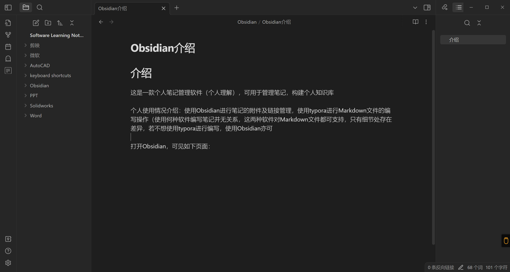
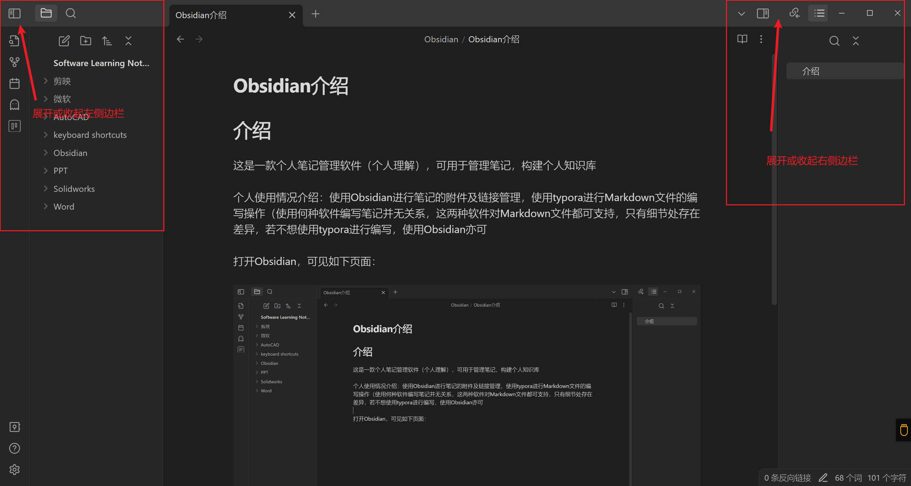
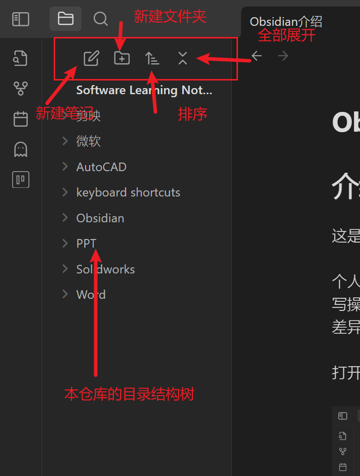

# 介绍

这是一款个人笔记管理软件（个人理解），可用于管理笔记，构建个人知识库

个人使用情况介绍：使用Obsidian进行笔记的附件及链接管理，使用typora进行Markdown文件的编写操作（使用何种软件编写笔记并无关系，这两种软件对Markdown文件都可支持，只有细节处存在差异，若不想使用typora进行编写，使用Obsidian亦可）

打开Obsidian，可见如下页面：

左右侧边栏可通过按钮进行收起

## 左侧边栏

在左侧边栏中，能够查看文件列表，如图所示在文件列表页面能够：[Markdown语言](相关操作/Markdown语言.md)、新建文件夹、排序、全部展开，并查看到本仓库的全部目录结构树

## 页面中央

页面中央是标签页，用于展示笔记

## 右侧边栏

在右侧边栏中能够查询到当前标签页的出链、反链、大纲以及标签
