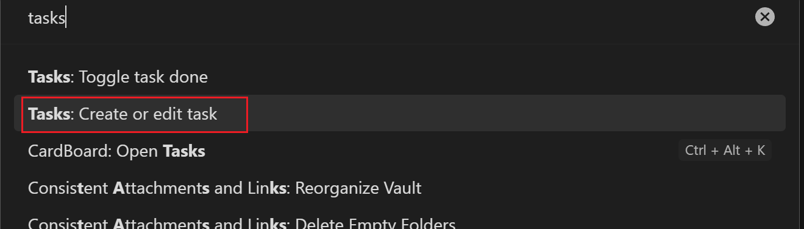

# 介绍

在 Obsidian 中做简单的任务管理，就需要 “ Tasks ” 插件,它可进行任务添加，设定任务日期，快速汇总查询任务便于进行项目管理。相比 dataview tasks 插件命令更简洁

且创建的任务可搭配 [看板任务管理插件CardBoard](Obsidian看板任务管理插件CardBoard.md) 使用

# 操作

## 创建任务

在Obsidian中使用 “ CTRL + P ” 快捷键可以打开命令行，输入 “ task ” 选择 `create or edit task` 即可创建一个任务



如下图所示为创建任务的窗口


比如 创建一个计划明天开始写作的任务

```markdown
- [ ] pkmer 开始写作 ⏳ 2023-05-15
```

创建一个明天之前必须完成的任务

```Markdown
- [ ] 整理笔记 📅 2023-05-15
```

在Obsidian中可通过快捷键便捷的将当前行内容转化为任务（**推荐使用这种方法创建任务**，原因与[CardBoard插件](Obsidian看板任务管理插件CardBoard.md#与Tasks插件配合说明)有关，并推荐使用CTRL + SHIFT + T快捷键，因为Typora也是这个快捷键转化成待办事项）


## 查询任务

在不同笔记里的任务，可以通过 tasks 插件的代码块，进行搜索并聚集展示

### 查询语法

- 完成/未完成：done 或 not done
- 完成日期：done before/after/on 日期
- 无到期日：no due date
- 到期日过滤：due before/after/on 日期
    - 日期可使用 today, yesterday, tomorrow, next week， last Friday, in two weeks 等
- 路径
    - 要搜寻：path includes 路径
    - 不搜寻：path does not include 路径
- 事项描述
    - description includes 字串
    - description does not include 字串
- 最靠近标题
    - heading includes 标题
    - heading does not include 标题
- 是否重覆：is recurring, is not recurring
- 排除某个事项：excludes 清单事项
- 限制显示事项数目：limit to 数值 tasks
- 排序：sort by (status|due|done|path|description)
- 显示样式隐藏 hide
    - edit button
    - backlink
    - done date
    - due date
    - recurrence rule
    - task count

### 例如

查询未完成的任务

~~~Markdown
```tasks
not done
```
~~~

查询明天的计划的任务

~~~markdown
```tasks
not done
scheduled on tomorrow
```
~~~

查询明天到期的所有未完结任务

~~~markdown
```tasks
not done
due  tomorrow
```
~~~

查询所有在未来两周内到期的未完成任务

~~~markdown
```tasks
not done
due after yesterday
due before in two weeks
```
~~~

