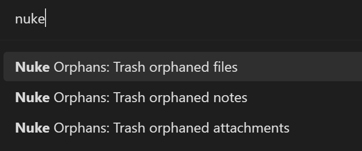
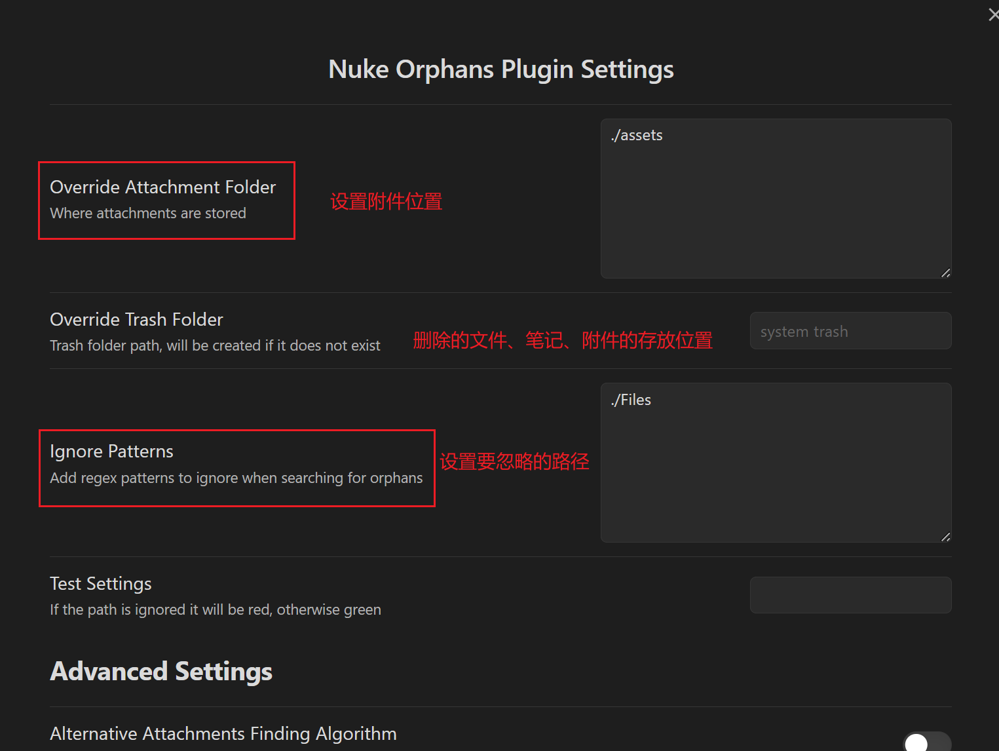

# 介绍

Nuke Orphans Obsidian 插件是一个可以清理孤立文件和附件的插件。它提供了三个命令，可以通过命令面板运行。插件会在清理文件前始终询问用户是否确定。用户可以通过 Obsidian 内部或手动安装来使用该插件。该插件适用于需要清理孤立文件和附件的用户，可以帮助用户快速清理不需要的文件，提高文件管理效率

# 操作

使用 “ CTRL + P ” 的快捷键打开Obsidian的命令面板，输入Nuke可进行相应操作

该插件提供了删除孤立文件、孤立笔记、孤立附件的操作

在设置中能够指定对附件的检索位置以及要忽略的路径

