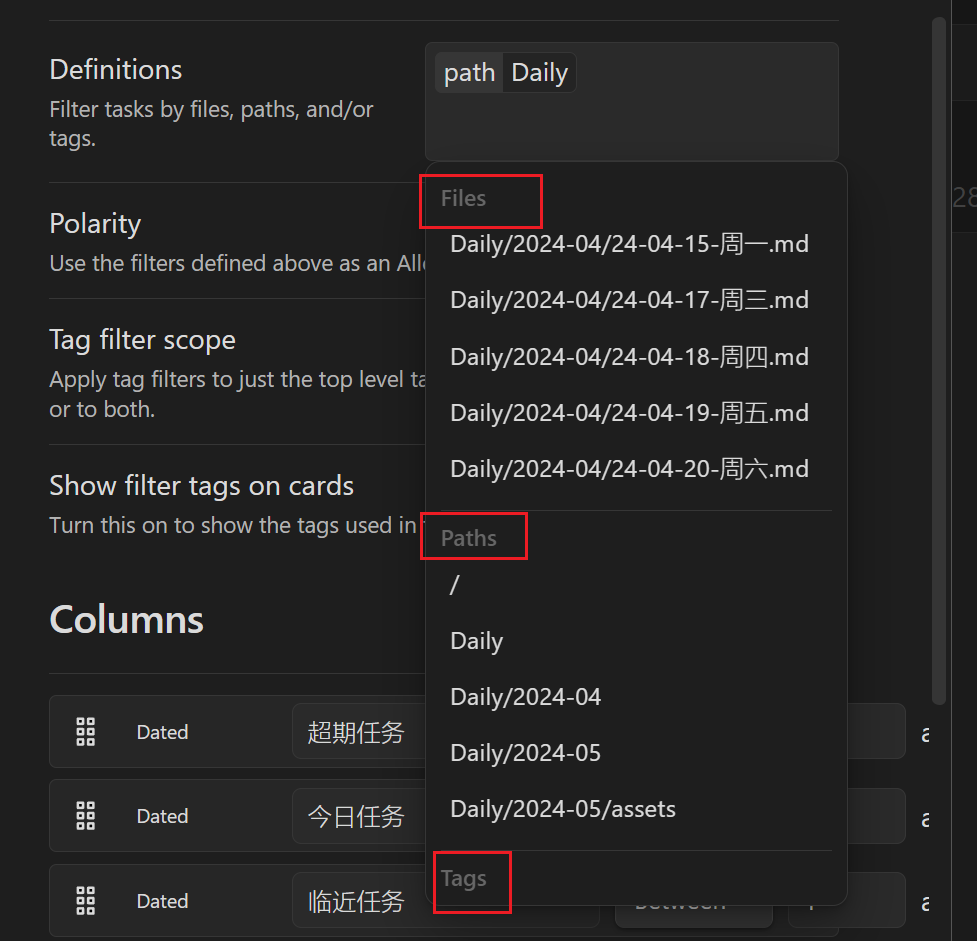
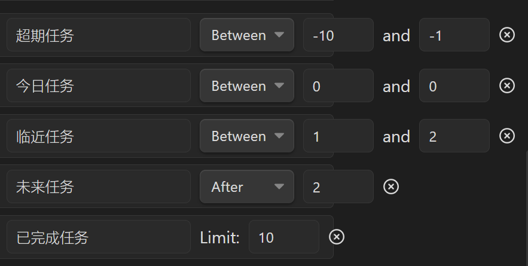
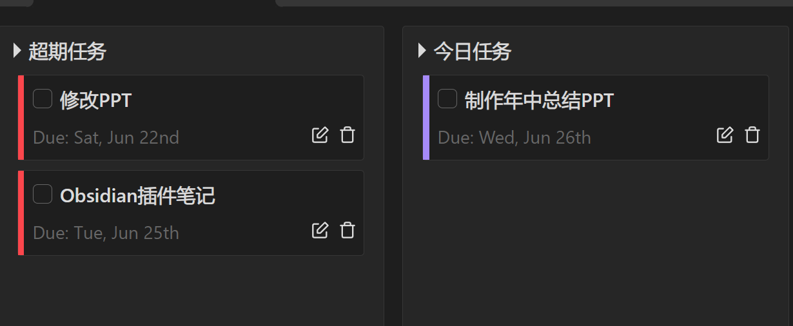

# 介绍

看板模式的优点是非常显而易见的：

- 以简单的图形化的方式呈现任务，方便用户快速了解任务进展状况，不需要进行复杂的查询和过滤，可以提高用户的工作效率，
- 特别是在快速迭代、简短的场景中，因为它可以在视觉上提供即时的反馈和清楚的信息，帮助用户更快地理解任务和进展。

Obsidian Cardboard 是一款在 Obsidian 笔记应用中实现看板模式任务管理的插件。它可以将你的笔记中的任务转换为看板卡片，每个看板都代表一个特定的项目或任务，你可以在看板上管理任务，以便更好地跟踪你的进度

搭配[Tasks插件](Obsidian任务管理插件Tasks.md)使用，可以在任意笔记中建立待办任务，然后统一到 “ cardboard ” 界面中管理。而不需要为了管理任务，去看板界面，一个个维护这个看板和笔记关系，源于作者的努力，只要你使用的是Obsidian的里面的待办任务格式，就可以处理

# 操作

- 安装后打开插件即可使用

    - 点击 Ribbon 区域的 “ CardBoard ” 图标，即可打开 “ CardBoard ” 界面

    - 或者使用命令面板输入 “ CardBoard ”

    - 在Obsidian中设置快捷键

        

在看板设置面板，可进行操作：

- 自定义看板名称，方便你管理不同的任务进度，比如项目 A 和 项目 B，当然，你也可以将 工作和生活的看板分别设立

- 看板的组成方式：

    - 基于日期：默认模式，按照传统的日期方式管理任务进度。
    - 基于标签：使用标签来定义列

- 点击看板卡片中的任务，会直接关联到笔记的具体位置（这样设置非常利于管理和追溯原理）

- 允许设置任务的过滤方式：

    - 通过日期管理任务

    - 通过指定路径，或者兼容 dataview 方式来管理任务

    - 通过任务标签来管理任务

        

## 行列设计情况

- Between是包含关系，包含-10天的任务与-1天的任务
- After是不包含关系，包含2之后的任务，即包含3
- Before是不包含关系，与After相似

## 与Tasks插件配合说明

CardBoard是依据Tasks的Due来进行判断的

故而在设置任务时，只要设置该任务的截止时间即可。**注意**：任务内容与图标之间空一格

