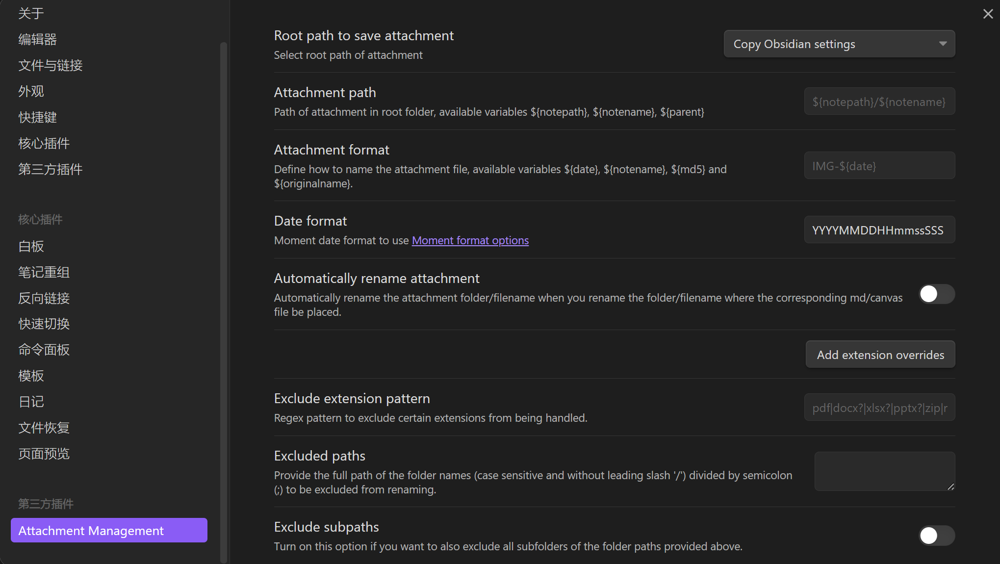
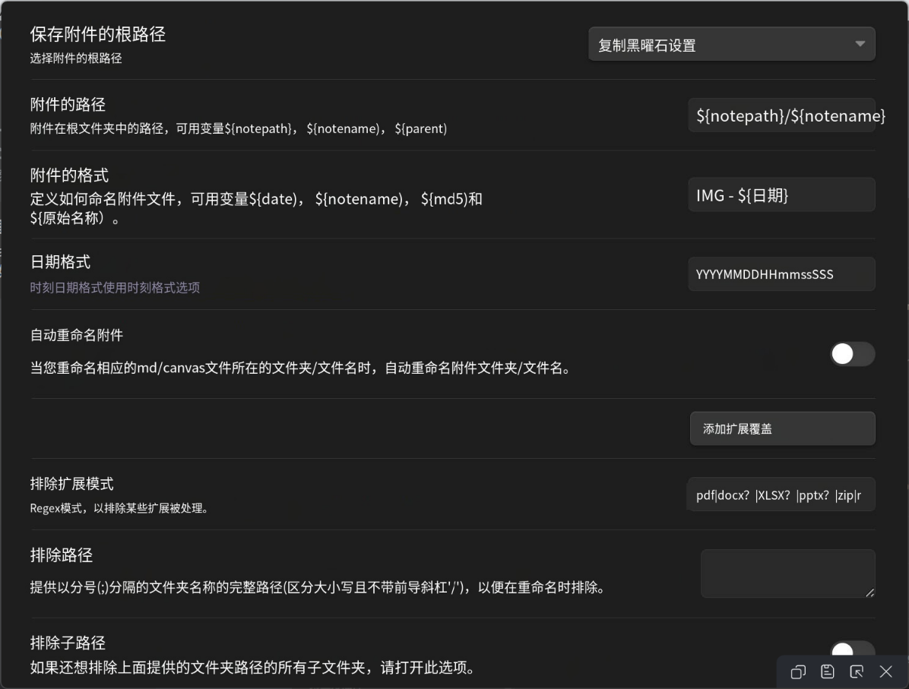
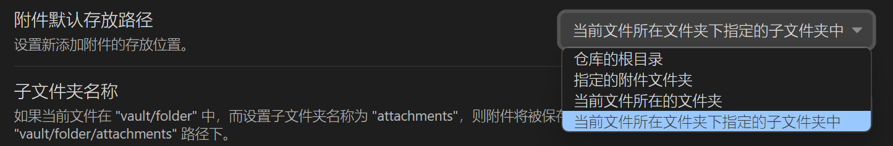
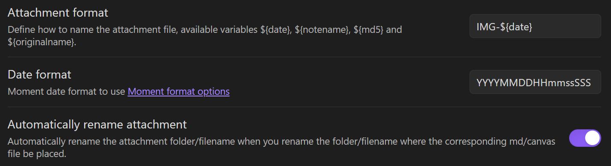

使用Obsidian的Attachment Management插件能够管理附件

**优点**

1. 能够对附件命名统一规范
2. 在Obsidian中移动文件后，附件也会随之移动到相应位置

如图所示是该插件的配置页面

翻译为：

保存附件的根目录，即管理markdown文件内的附件上传后存放的位置

而附件的路径则是在“附件根目录”下对附件的目录进行管理——若Obsidian配置附件默认存放目录是仓库的根目录，那么对“附件的路径”保持**${notepath}/${notename}**的配置，能够让附件在根目录下的存储与文件存储结构相同。由于我采用Typora编写Markdown，仅用Obsidian进行管理，附件默认存放位置为当前目录下的assets目录，故而无需特别对附件的路径进行管理，将其删除清空即可

附件的格式，即附件的命名规范，使用Obsidian在文件中直接粘贴附件的话，附件会以设置的格式进行命名。若附件已经存在，则不会对其改名，只有在移动文件时，附件随之移动，同时改名。

日期格式即附件命名规范下日期的格式设置

***关闭自动重命名附件***，那么在移动文件时，附件不再随之移动

所以***推荐开启自动重命名附件***（Automatically rename attachment）功能。开启后如果不配置附件的格式（Attachment format）的话，附件会按默认的方式进行重命名（反正都要重命名，配不配置无所谓了）

