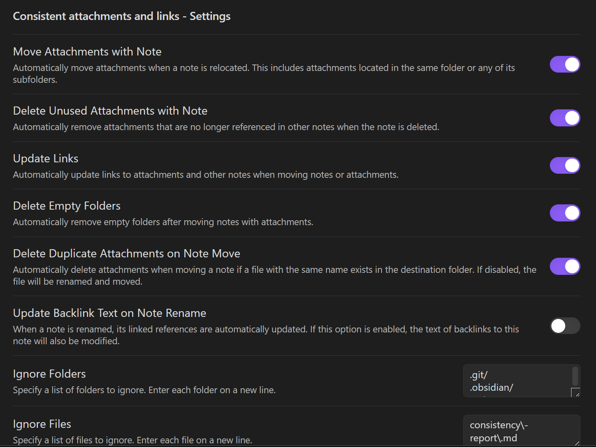
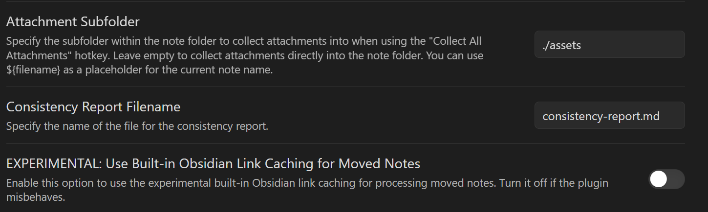

# 介绍

这个插件对附件的管理功能相较于 [Attachment Management](Obsidian附件管理插件Attachment%20Management（不推荐）.md) 更完善，如下是插件的配置页面

各个选项对应的中文含义是：

- 移动笔记时自动移动附件
- 删除笔记时，自动删除不在其他笔记中引用的附件
- 移动笔记或附件时，自动更新附件和其他笔记的链接
- 移动带有附件的笔记后，自动删除空文件夹
- 移动笔记时，如果目标文件夹存在同名文件，则自动删除附件。禁用的话文件将被重命名并移动
- 重命名注释时，其链接的引用将自动更新。启用后，反向链接的文本也将被修改
- 忽略文件夹
- 忽略文件
- 附件文件夹
- 一致性报告文件名
- 使用内置的Obsidian链接缓存移动笔记

## 优点

可以忽略掉指定文件夹，或者指定文件，在此上体验胜于 [Attachment Management（不推荐）](Obsidian附件管理插件Attachment%20Management（不推荐）.md)

可以自动更新引用链接，使用该插件可以在一定程度上代替 [Update Relative Links](Obsidian自动更新相对路径插件Update%20Relative%20Links.md) 插件
