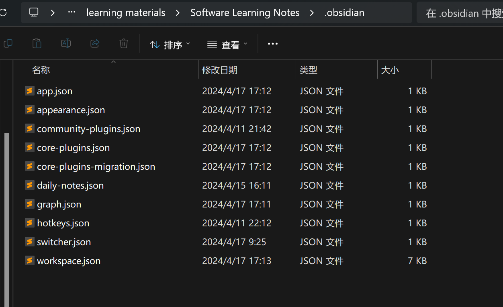
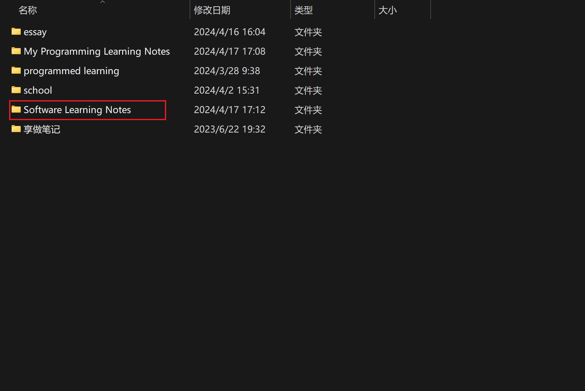

# Obsidian仓库配置文件存储位置

Obsidian仓库的配置存储于该仓库目录下的.obsidian目录下

# 多库统一配置

想要多库统一配置，那么只需要让配置文件保持一致即可

有两种方式

***一：复制粘贴***

这种方式不推荐，仓库多的话每次修改需要多次复制粘贴

***二：使用mklink构建软链接***

例如我要新建一个仓库，先将这个仓库的存放目录创建出来，保证文件夹内部为空

找到我们的参考仓库，例如我要以My Programming Learning Notes仓库为参考仓库

那么打开这个仓库的存放目录，找到.obsidian目录，打开它

打开CMD命令行窗口

输入命令：`mklink /j "目标地址" "源地址"`

例如：`mklink /j "E:\learning materials\Software Learning Notes\.obsidian" "E:\learning materials\My Programming Learning Notes\.obsidian"`

这样就可以创建出一个软链接，软链接会将My Programming Learning Notes这个参考仓库的整个.obsidian文件夹链接到Software Learning Notes仓库中，这样两个仓库使用的配置就完全一样了

**我们在`My Programming Learning Notes`仓库中做出的配置已修改会同步到`Software Learning Notes`仓库中**

**但在`Software Learning Notes`仓库中做出修改，配置不会同步影响到`My Programming Learning Notes`仓库**

# 各个配置文件的作用

1. **config.json**：
    - 存储Obsidian的基础配置信息，例如默认编辑器模式、预览模式、是否启用实时预览、界面语言设置等
2. **workspace.json**：
    - 工作区配置文件，记录了打开窗口时的工作区布局，如笔记文件、面板位置等
3. **keymap.json**：
    - 用户自定义快捷键配置文件，可以在这里定义个性化的键盘快捷键组合
4. **themes**：
    - 存放已安装的主题文件夹，每个主题有自己的CSS样式表文件，用于更改Obsidian的界面样式
5. **plugins**：
    - 插件目录，包含了所有安装的Obsidian插件。每个插件都有自己独立的文件夹，其中可能包含插件的核心代码、资源文件和设置文件
6. **snippets**：
    - 存放用户自定义的Markdown片段，这些片段可以在编辑笔记时快速插入预定义的文本块
7. **metadata-cache.db** 或类似的数据库文件：
    - 存储元数据缓存，用于加速笔记之间的链接查找和显示
8. **graph.css** 或其他自定义CSS文件：
    - 如果用户对Obsidian的图形视图（知识图谱）进行了定制，相关的CSS样式会在此处
9. **vault-specific** 配置文件或目录：
    - 某些插件可能为每个特定的 vault（知识库）提供单独的配置文件