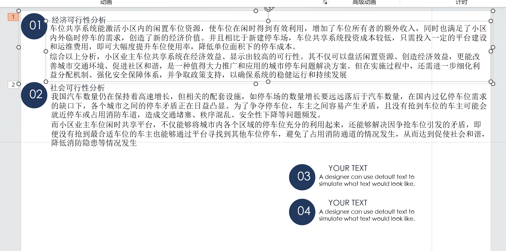
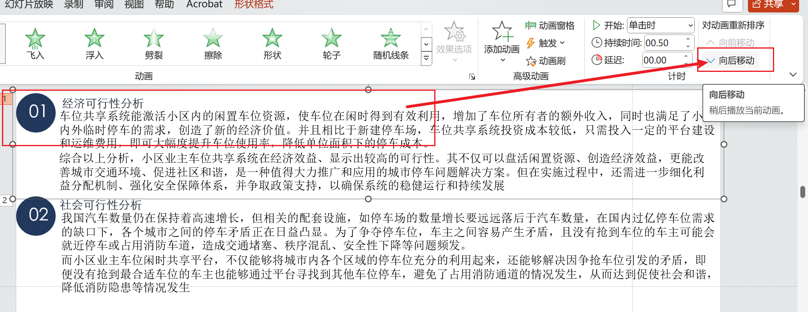
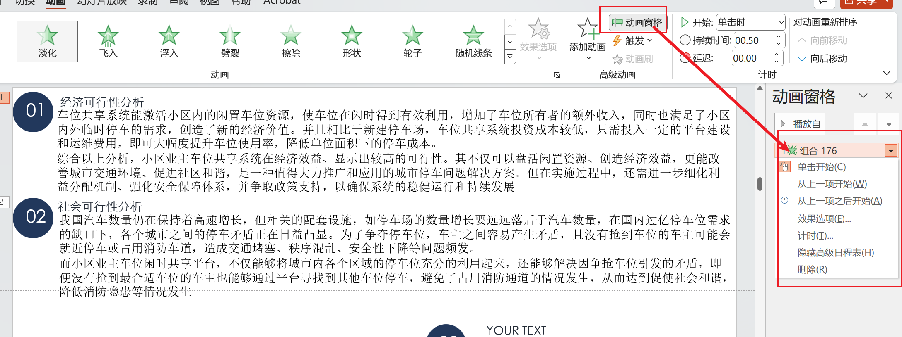

在PPT中为文本设置了动画，但是其顺序错了，要如何调整不同元素的先后出现顺序

如图所示有两个动画效果，现希望社会可行性先出现，经济可行性后出现，那么该如何操作呢

# 方式一

选中文本框之后，在“动画”选项卡中选择“向后移动”就能将经济可行性分析的排序往后挪一位

但是这种方式只能对整个动画前后移动，不能做到精细的配置

# 方式二

相较于方式一，这种方式能够对动画进行更精细的配置

选择“动画”选项卡之后，选择“动画窗格”，能够对动画的顺序、以及其他相关设置进行配置

