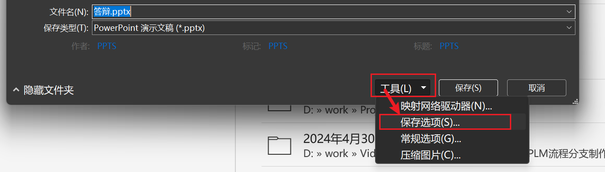
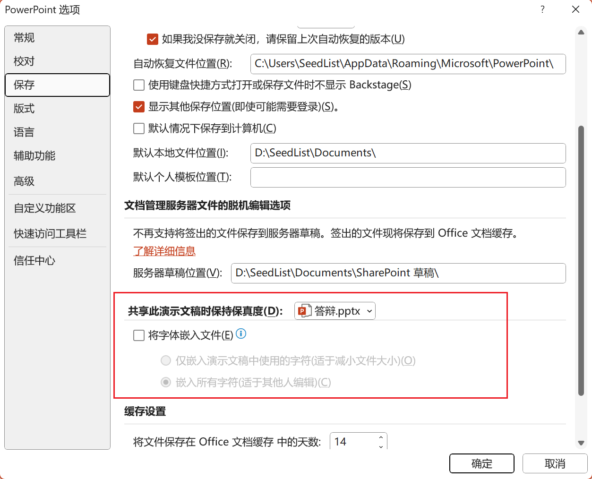

# 介绍

PPT嵌入字体，能够保障PPT保存后在他人电脑上打开，PPT字体不会失效

# 方式一

编辑完PPT后点击“另存为”

在选择保存位置的页面点击“工具”按钮，选择“保存选项”

在保存选项中可以自定义保存方式，找到“将字体嵌入文件”

此时有两个选项，若为“仅嵌入演示文稿中使用的字符”，则保存出来的PPT大小适中，但不便于他人修改、编辑，对于特殊字体只能使用到PPT保存时嵌入的那些文字

而若选择“嵌入所有字符”，则保存出来的PPT会比较大，更适合他人编辑、修改，即便是特殊字体，也可以使用任意文字