# 1、打开不透明印章

打开ps软件，菜单栏选择 文件-打开 选择本地不透明印章 打开

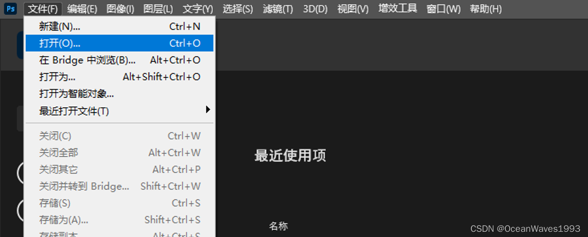

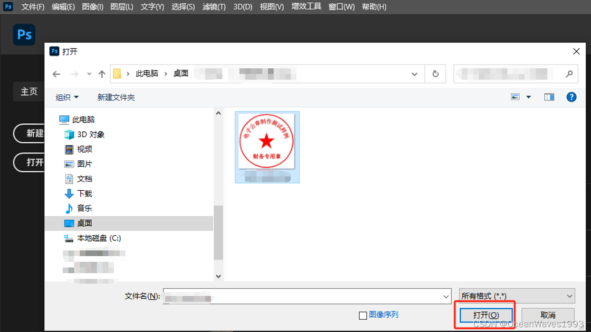

# 2、抠出红色印章

ps菜单栏 选择 选择-色彩范围 点击色彩范围

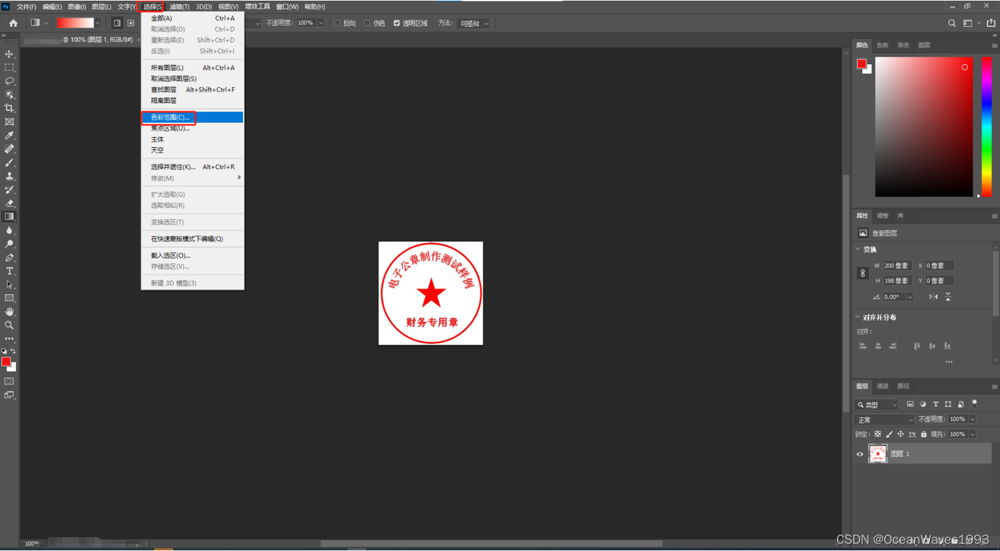

色彩范围窗口 取样颜色选择 红色 点确定

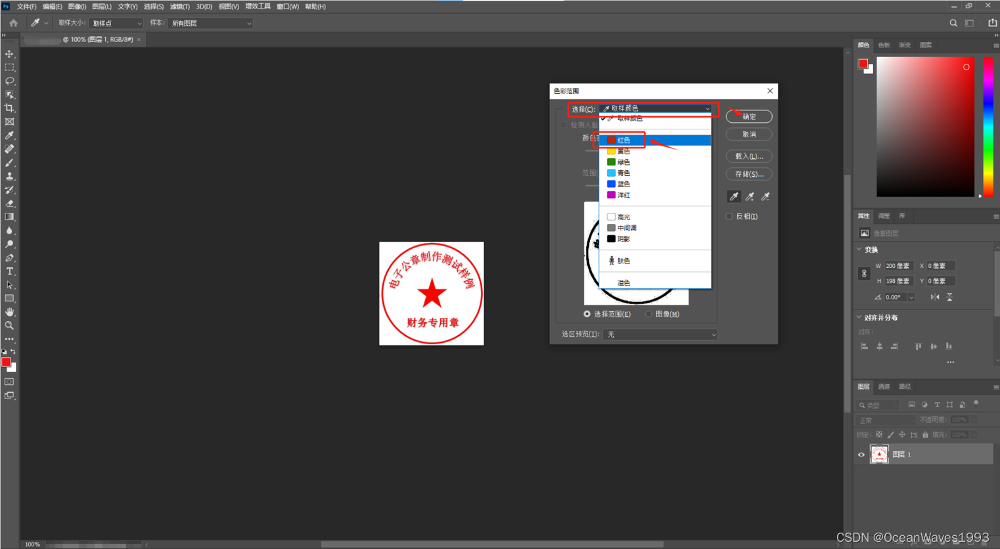

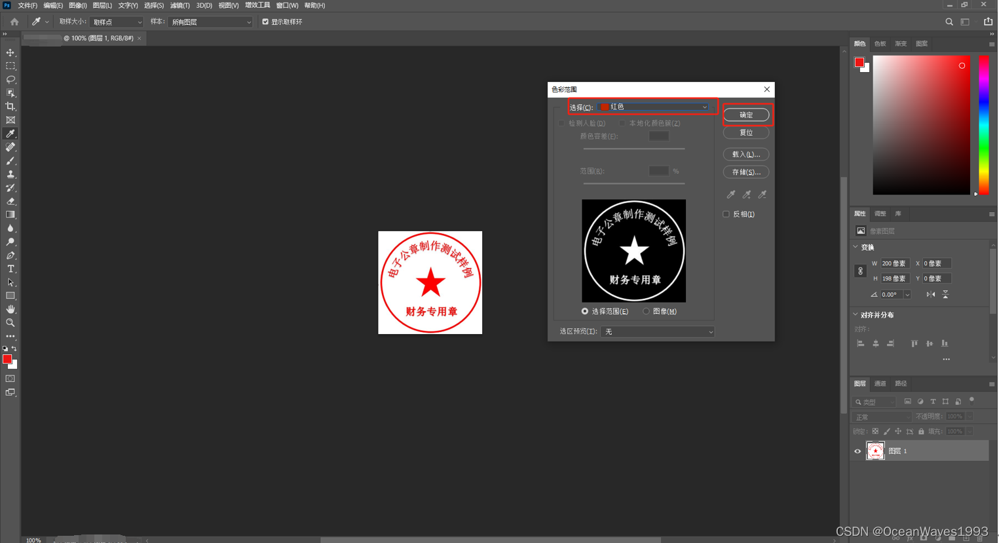

点确定后ps界面如下

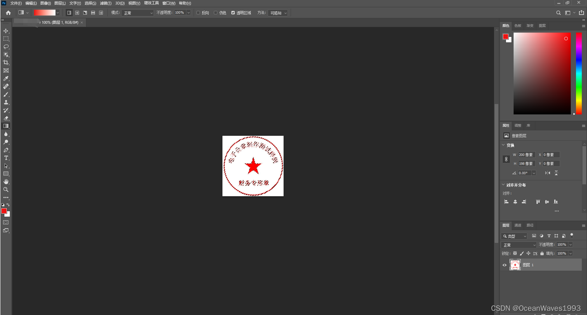

# 3、新建图层

点击右下角的新建图层按钮

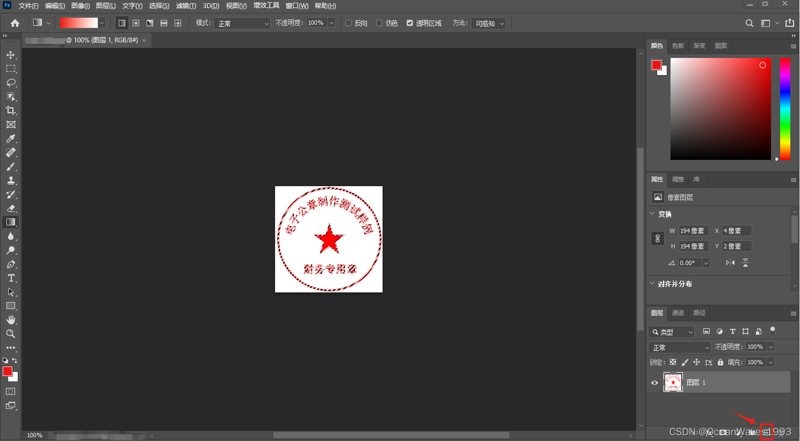

新建图层后 如下 图层2是新建的图层

隐藏第一个图层 鼠标选中第一个图层 然后点击第一个的隐藏图层按钮

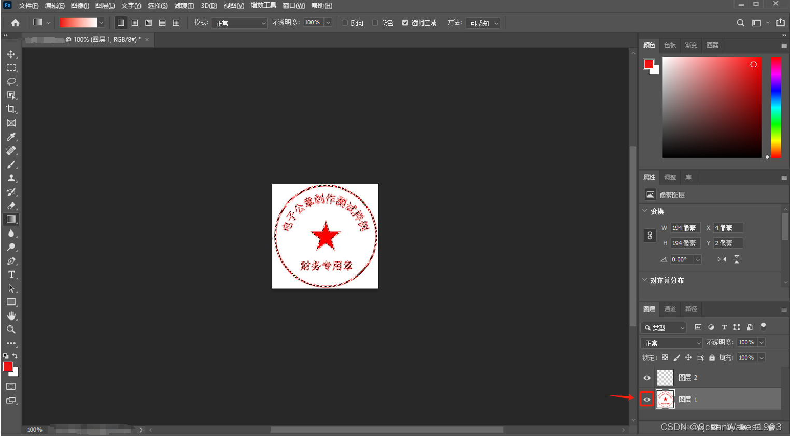

隐藏第一个图层后 效果如下

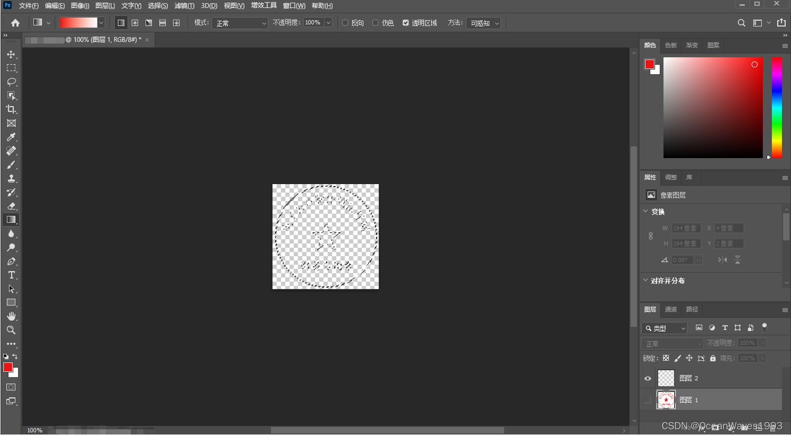

# 4、填充红色印章到新图层

鼠标选中图层2

ps 菜单栏 选择 编辑-填充

填充窗口如下

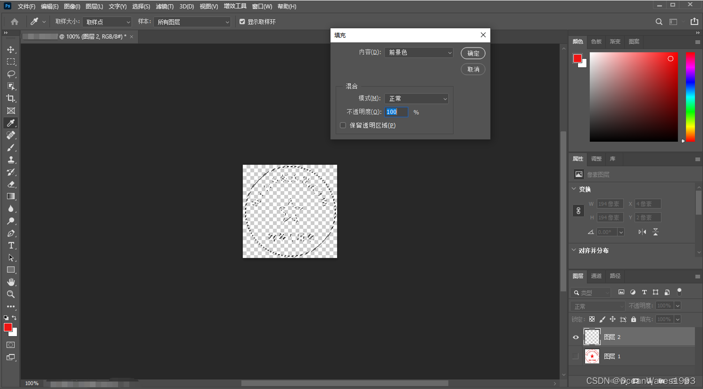

内容选择 前景色 点确定

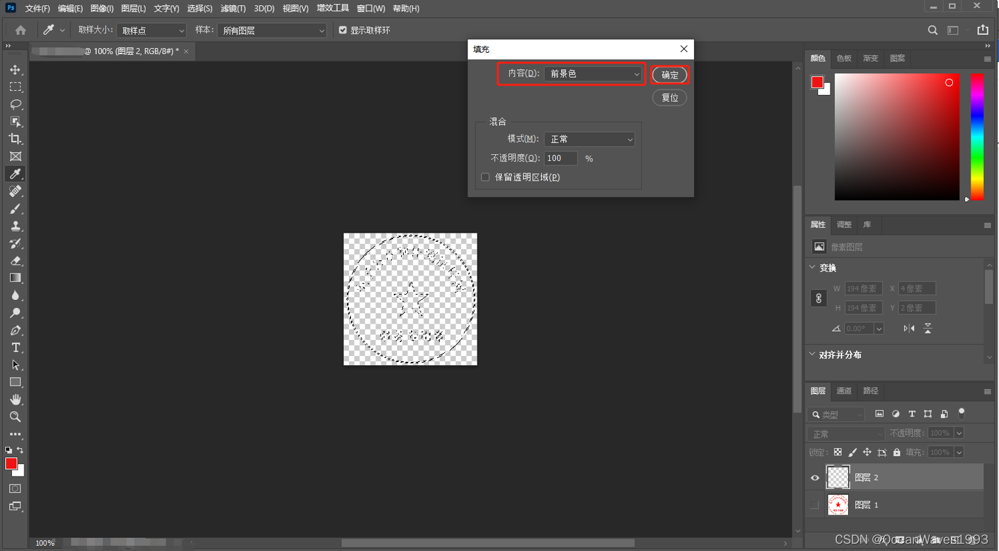

点确定后 效果如下

# 5、导出透明印章

ps 菜单栏选择 文件-导出-快速导出为png

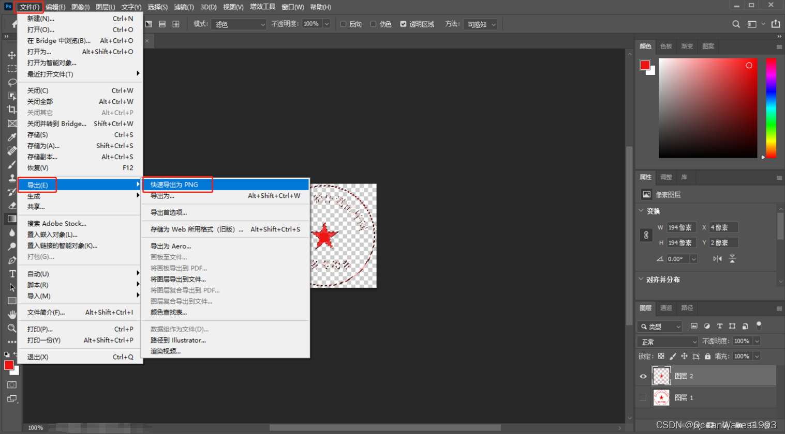