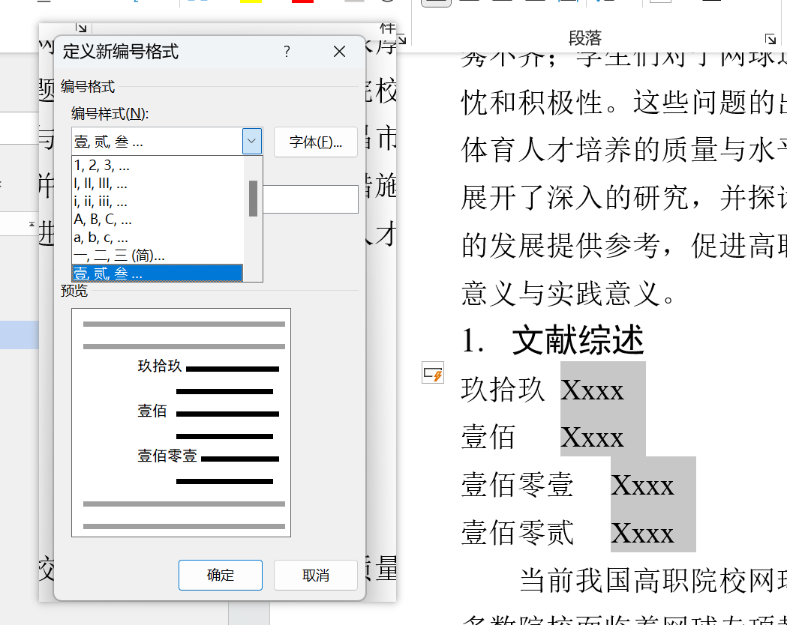
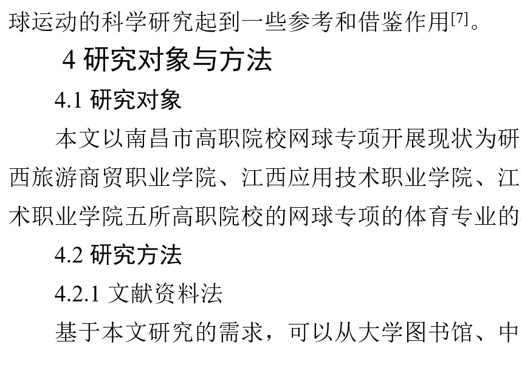
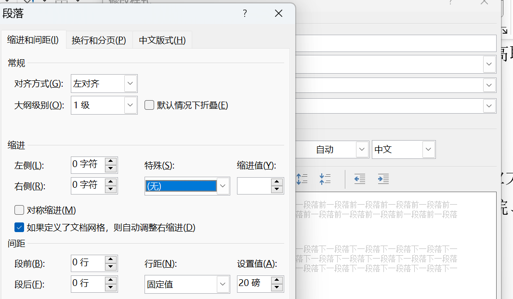

# 介绍

自动编号能够对论文中的内容进行编号，在“开始”选项卡中找到“段落”，选择编号即可创建编号列表

点击下拉箭头可以选择我们要创建编号的格式

例如我选择带括号的编号，那么文章中当前光标所处位置就会多出一个带括号的编号，如图所示

# 单级编号列表

介绍部分中展示的就是单级列表，这种列表的特点是只有一个层级，是不会因样式的变化而出现改变的，如图所示，编号1的样式与其他内容的样式完全不同，但这些内容的编号排布仍然是从1到5，不因样式的不同而不同

## 设置编号值

若想要改变编号的起始值，则可在“编号下拉框”中选择“设置编号值”

对编号值的设置包含两类，其一是“开始新列表”，选择该选项，并在“值设置为”中输入新列表的起始值即可对选中范围开启一个新的列表

### 设置起始值

例如设置新列表的起始值为99，那么新的列表第一行就是99，后续行则在99的基础上延续，如图所示

## 定义新编号格式

在“编号下拉框”中选择“定义新编号格式”，可以对使用编号的格式进行调整

如图所示，可调整范围包含编号的样式，编号的格式，以及对齐方式

### 编号格式

例如希望使用的编号后面不要带上“.”，那么只需要将“编号格式”中，99后面的小点删除即可

### 编号样式

如果不希望使用阿拉伯数字编号，则可以在”编号样式“中修改编号的样式，例如将编号的样式修改为大写汉字

# 多级编号列表

在论文编写过程中，想要让一级标题、二级标题、三级标题的编号能够自动生成，这个时候使用单级编号就不够了，因为没法做到一级标题是1XXX，二级标题是1.1XXX

这种时候就需要使用多级编号列表，也就是单级编号列表旁边的那个

例如这篇论文希望能够让标题左对齐顶格，编号与标题之间只存在一个空格，那么在已经设置好了标题样式的情况下，我们需要选择多级列表

word预设了一些多级列表，但是这些预设的多级列表并不能很好的满足我们的需求，想要使用到一个称心如意的多级列表编号，还是得自己动手才行

## 定义新的多级列表

自定义多级列表格式，需要选择“定义新的多级列表”

打开后，我们能够看到这样的一个页面

在这个页面中我们能够定义自己想要的多级列表

### 级别选择

想要对一级编号进行设置，那就选择“要修改的级别”为1即可，想要对二级编号进行设置，那就选择“要修改的级别“为2即可

### 链接样式

我们希望一级编号自动就能与一级标题关联，这样论文中已经预设好的标题可以自动生成，那么我们选择“将级别链接到样式”为一级标题即可

### 要在库中显示的级别

目前尚不清楚这个“库”是指样式库还是什么库，目前也不知道有什么用，只知道无论是对一级编号做定义还是对二级编号做定义，这个显示的级别都是相同的

### 起始编号

多级列表的起始编号设置与单级列表的设置起始值作用是一样的，在论文各个标题编号都是自动生成的情况下，保持起始编号为1即可

### 定义编号格式

多级编号列表定义编号格式和单级列表定义编号格式一样，我们希望标题是1 XXX或1.1 XXX的情况下，只要保证编号的格式只有数字而没有其他符号即可

### 编号位置设置

编号位置设置包含编号的对齐方式、对齐位置、文本缩进位置

在通常情况下编号的对其方式设置为左对齐即可

和单级编号一样，在默认情况下编号是会导致标题缩进的，但我们不希望缩进怎么办，将文本缩进位置改成零就好了

#### 设置所有级别

一级一级的设置编号的缩进量太麻烦了，点击“设置所有级别”按钮，然后修改缩进量就能让整个多级列表的所有编号缩进量得到统一管控了

### 编号之后

前面提到过，希望编号与标题之间空一个空格，而不是一个制表位，对于这种需求，我们只需要将“编号之后”修改为“空格”即可

这样一来编号后会自带一个空格，这个空格是不能手动删除的，要删就连带着编号一起删除，好处是不用我们手动在编号与标题之间添加空格了

## 使用多级列表

按照需求设置多级列表的格式，有三级标题就设置三级编号，有四级标题就设置四级编号，设置完成之后点击确定就能应用，如图所示

### 出现缩进的处理方法

使用之后就会发现这和我们想要的有点不一样，尽管设置了无缩进，但word还是出现了缩进，此时需要找到样式，选择修改

在格式中选择段落

在缩进中进行调整，在原先中我们已经设置了左右缩进为零，无特殊缩进，那么在这种情况下我们什么也不用做，只要打开这个页面后点击确定保存即可

保存后将光标置于标题上，重新选择该样式即可完成修改

目前只能对标题一个个重新应用样式，尚未找到一次性生效的方法