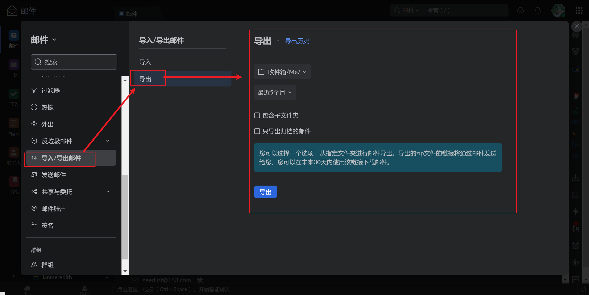

# 介绍

每个邮箱的可用存储空间都是有上限的，在上限将满的时候就需要删除历史邮件，为新邮件腾出空间。对于重要，需要备份保存的邮件，直接删除显然不太合适，此时可以将邮箱中的邮件导出，导出的邮件将以.eml格式存储，可直接用邮箱客户端打开，其中的附件仍可正常下载

# 操作

ZohoMail在设置中，选择 **==导入\导出邮件==** 选项，选择 **导出** 后，可选择要导出邮件的文件夹，以及要导出的日期，选择完成后点击 **导出** 按钮即可

