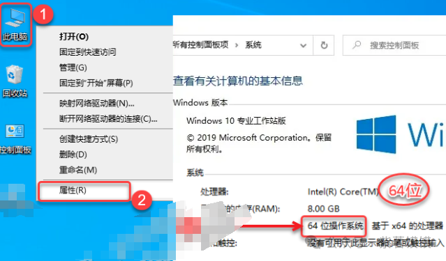

鼠标右击【CAXA电子图板2020】压缩包（win11及以上系统需先点击“显示更多选项”）选择【解压到 CAXA电子图板2020】

打开解压后的文件夹，根据安装电脑操作系统的位数打开对应的文件夹（我这里为64位操作系统）

附“操作系统位数”查看方法：鼠标右击桌面【此电脑或计算机】选择【属性】，在【系统类型】处可查看操作系统的位数，下图为64位操作系统

鼠标右击【CAXACAD2020SP0_x64_Setup】选择【以管理员身份运行】

点击【OK】

点击【下一步】

点击【我接受】

修改路径地址中的首字符C可更改安装位置（如：将C改为D表示安装到D盘），点击【安装】

软件安装中……

取消勾选【运行 CAXA ……】，点击【完成】

解压破解包前：必须要先关闭“所有杀毒软件(部分电脑自带的“McAfee”也要关闭）、防火墙、Windows Defender”，否则可能会被杀毒软件误杀清除程序或致无法正常运行

鼠标右击解压后的【Caxa2020 Patch[2019.10.26]]】选择【以管理员身份运行】

根据安装电脑的操作系统位数选择（我这里为64位），点击【GO】

点击【是】

安装完成