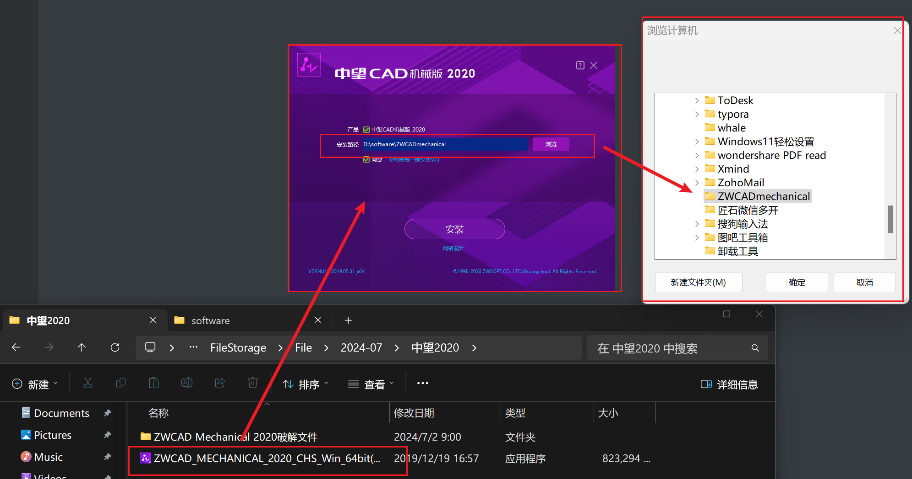
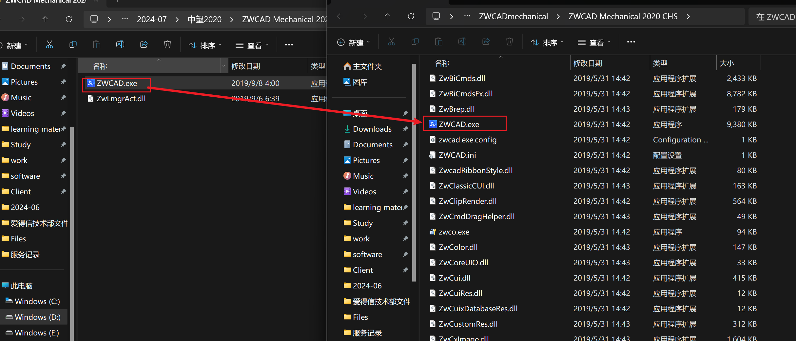

ZWCAD_MECHANICAL_2020_CHS_Win_64bit(20190531)程序就是中望CAD机械版2020的安装文件，直接双击安装即可

记得修改安装路径，不要放在C盘下

修改完成后点击安装即可，等待软件安装

完成后不要立即启动，打开中望CAD机械版2020的安装位置，将破解文件夹中的ZWCAD.exe与ZwLmgrAct.dll文件替换进去

替换后即可完成破解

安装完成后，貌似有两个版本（不确定）如果是中望CAD2020，在安装目录下直接找即可，如果是找中望CAD机械版2020，则需要找到安装目录下的Zwcadm目录