# 情况介绍

新买的电脑预装系统后，初次开机会提示登录，如果直接登录的话，系统会将用户名设置为邮箱前5位字符

或者是未登录使用本地账户，用户名为本地账户的名称

此时就有可能出现用户名为中文或不合自己心意的情况

其中，**重点注意用户名为中文的情况**，这并不能为使用电脑带来方便，相反是无穷无尽的麻烦，很多软件安装是不支持中文路径的，设置为中文只会导致软件安装失败，软件安装上了但没法用，软件能用，但是自己的用户名变成了乱码

# 前置步骤

## 查询用户名

若已经设置为中文或想要改用户名的，需要在C盘的“用户”或“users”文件夹下寻找用户文件夹

如图所示就是我电脑的用户文件夹列表

通常情况下会有一个“公用”文件夹，以及另一个自己命名的文件夹，我的是”SeedList“

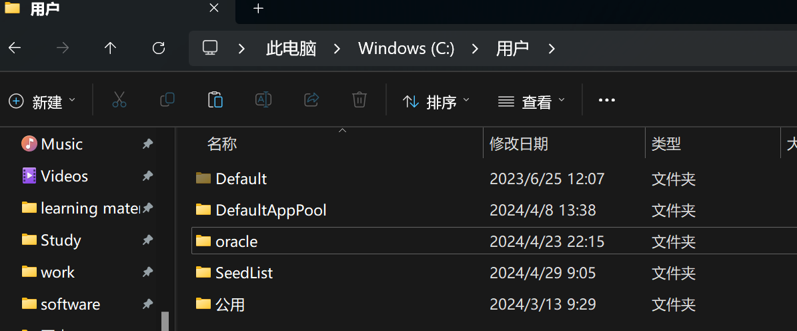

如图就是错误示范，用户名为“吕云凤”，自己还修改注册表弄出来了一个“blue”用户，当前用户是吕云凤

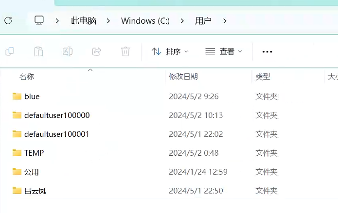

## 查询SID

在命令行窗口输入whoami/user命令查询用户信息，需要重点记录SID

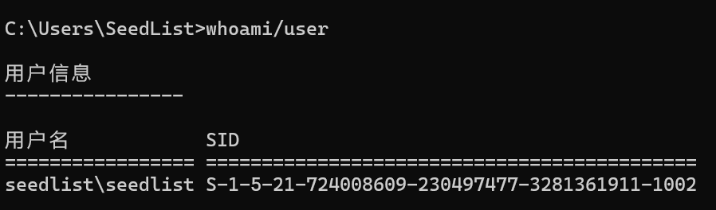

# 操作步骤

## 创建临时账户

先创建一个临时账户

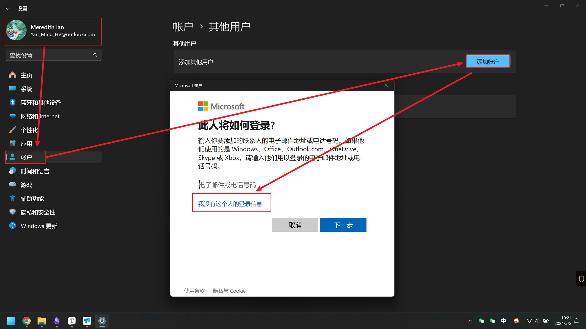

创建一个本地账户

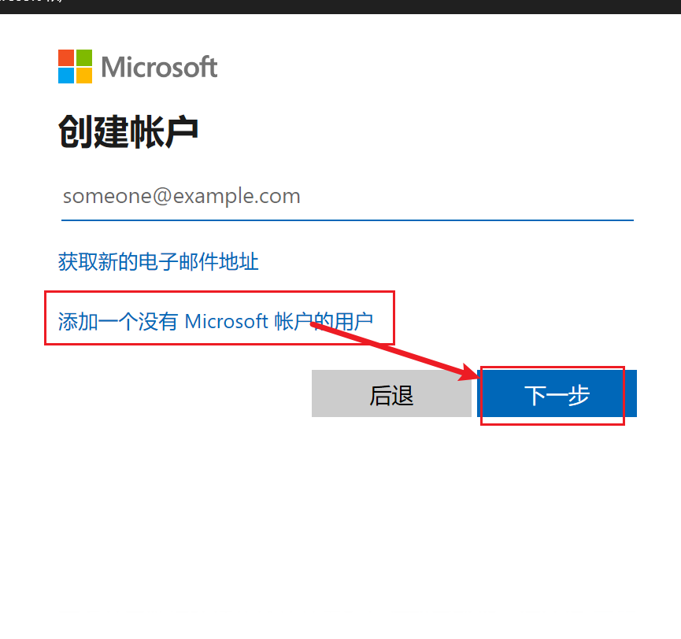

## 更改账户类型

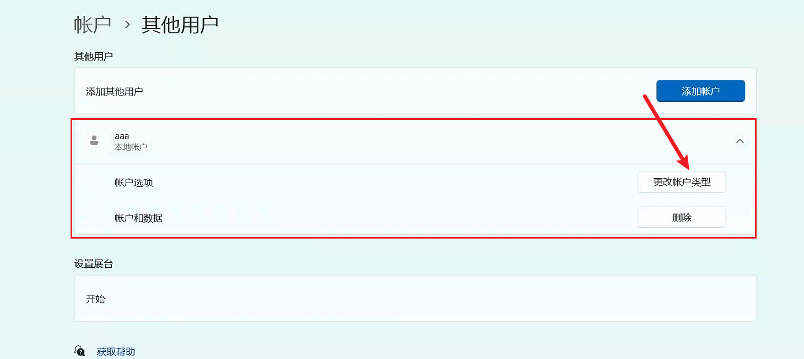

点击更改账户类型后更改为管理员类型

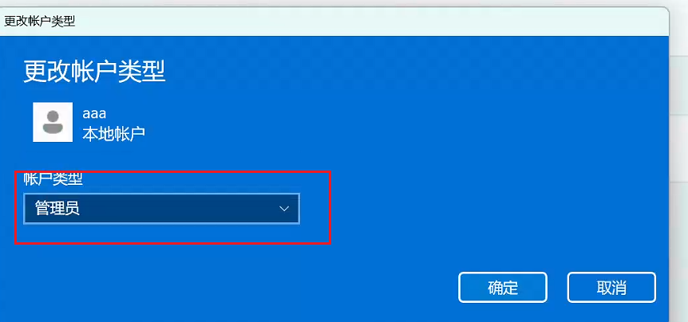

## 登录临时账户

注销当前账户，关机重启，登录临时账户，打开是一个新的桌面，进入到C盘用户目录下，对要修改的文件夹重命名

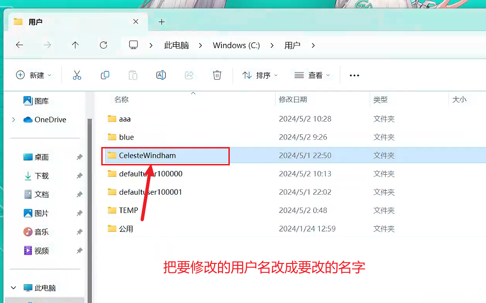

## 打开注册表

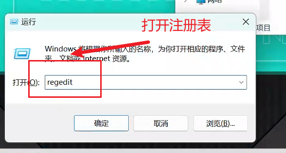

点击“是”

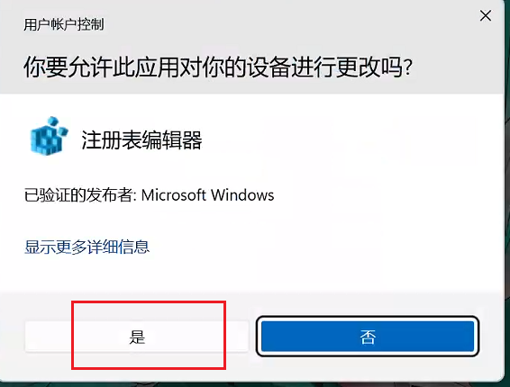

找到注册表中的HKEY_LOCAL_MACHINE\SOFTWARE\Microsoft\Windows NT\CurrentVersion\ProfileList，在这个路径下找到用户名的SID

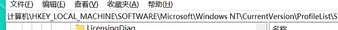

找到ProfileImagePath，修改这个数值为更新后的名称

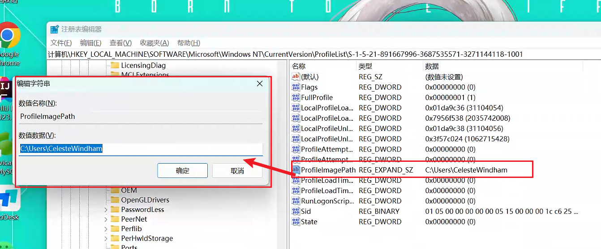

找到Usermanger目录

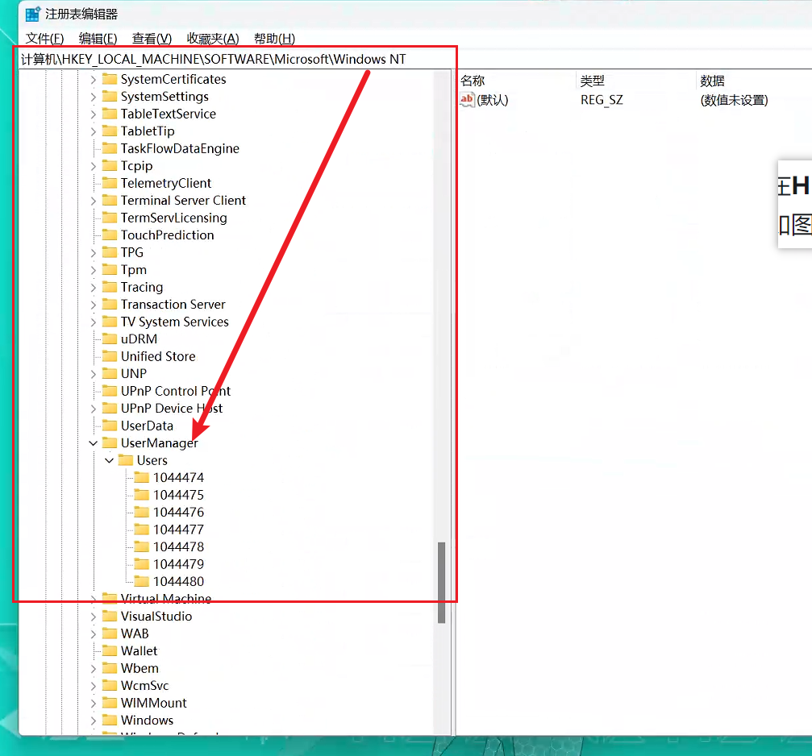

找到1044478，里面有个UserPicture

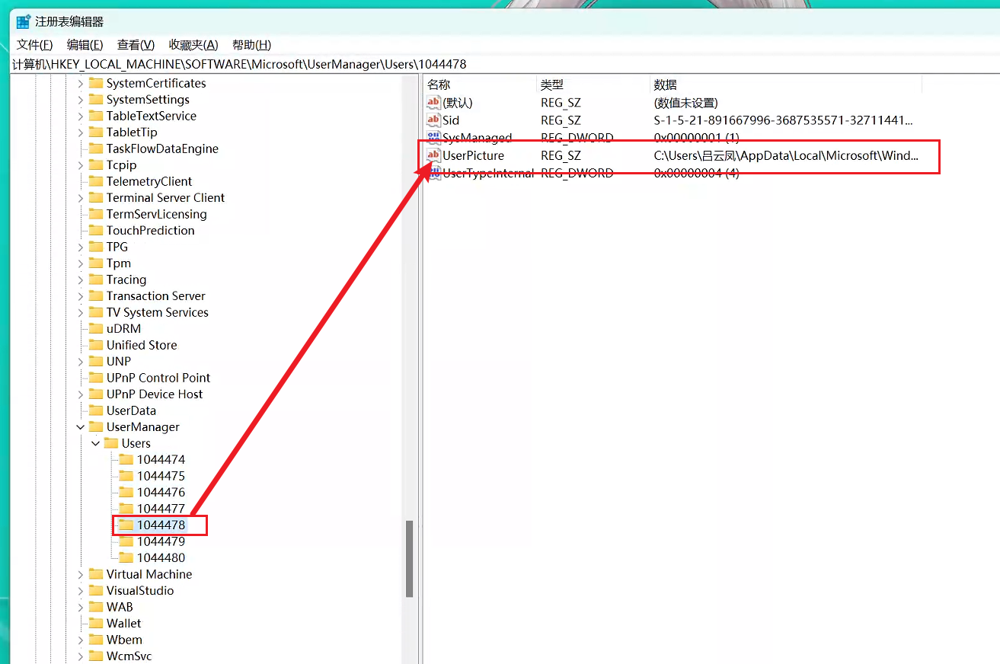

## 修改环境变量

修改完成之后，重启电脑，登录修改好的新账户

登录后打开环境变量，把一些没有变更的环境变量改成新的

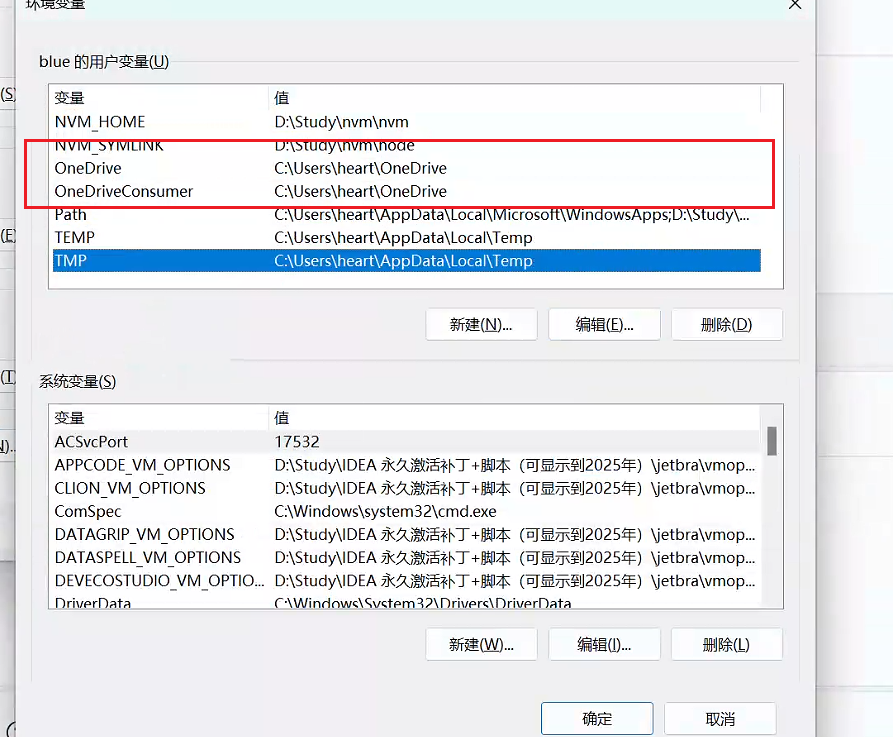

修改完成后点击确定进行保存

## 修改用户属性

使用Win+R，输入control userpasswords2

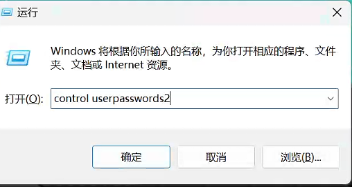

选择要修改的账户，右键属性进行修改，修改完成后应用即可

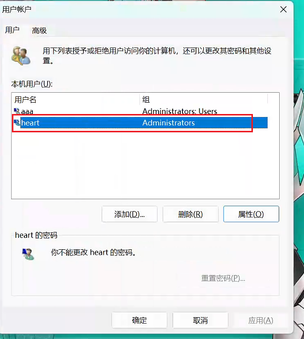

应用完成后重启电脑即可

最后删除临时账户即可